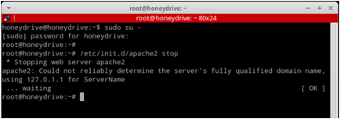
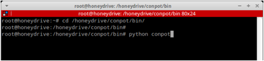
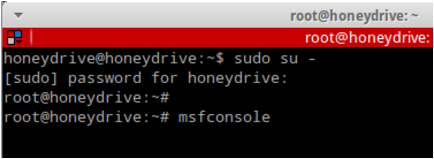
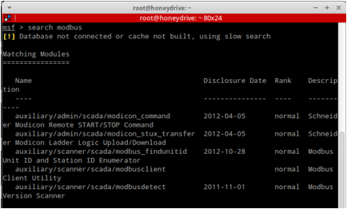
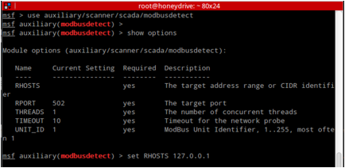
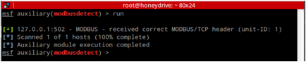
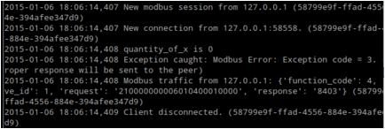

Conpot
======

Website
-------

<https://github.com/glastopf/conpot>

Description
-----------

Conpot is an ICS honeypot with the goal to collect intelligence about the motives and methods of adversaries targeting industrial control systems.

Video Walkthrough
-----------------

<video controls>
  <source src="Videos/1_550_Conpot.mp4">
  <source src="https://onedrive.live.com/download.aspx?cid=8D6C4317A39E3D29&resid=8D6C4317A39E3D29%2155678&canary=">
 
Your browser does not support html5 video.

</video>

Example 1: Usage
----------------

Conpot is a simple SCADA honeypot. Honeypots like this are incredibly
important as they match specific applications and they can serve to slow
down attackers attempting to find the real servers and services on your
network.

In this lab, we will be using Conpot, then connecting to it with
Metasploit.

To begin, please reboot your Honeydrive VM to ensure no rogue processes
are running.

First, we will need to stop the running Apache Service:

Remember, the password is 'honeydrive'

Next, we will need to start Conpot:

Then, we will use Metasploit to connect in and query the SCADA device.
Please start by opening a new terminal while leaving the Conpot terminal
active:

Once again, it can take a while for Metasploit to start. Also, for
reference, the sudo password is 'honeydrive'

One Metasploit has started, please search for any Modbus plugins:

We will be using the Modbusdect scanner:

Type in `set RHOSTS 127.0.0.1`

Then type run:

If you go back to the Modbus Window, you should see it logged the
connection:

Feel free to play with the other SCADA Metasploit modules.