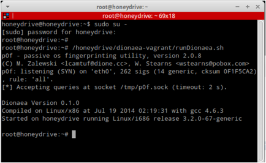
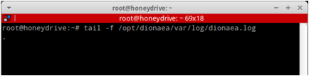
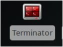
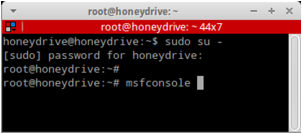
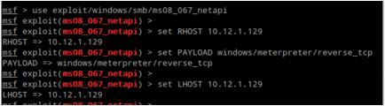
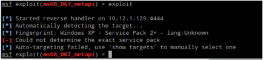
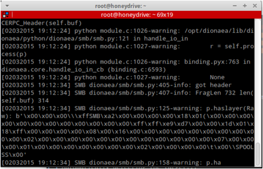

Dionaea
=======

Website
-------

<http://dionaea.carnivore.it/>

Description
-----------

Dionaea's intention is to trap malware exploiting vulnerabilities exposed by 
services offerd to a network, the ultimate goal is gaining a copy of the malware. 

Video Walkthrough
-----------------

<video controls>
  <source src="Videos/1_550_Dionaea.mp4">
  <source src="https://onedrive.live.com/download.aspx?cid=8D6C4317A39E3D29&resid=8D6C4317A39E3D29%2155676&canary=">
 
Your browser does not support html5 video.

</video>

Example 1: Usage
----------------

First, lets become root and start Dionaea

Please click the Terminal Icon:

Then become root and start Dionaea:

Note: The password is honeydrive

Next, lets start the logging for Dionaea:

Now, lets start up Metasploit in a separate terminal window:

Please click the Terminal Icon:

Then become root and start msfconsole:

Please remember it can take a while to start

Then, we will start the correct smb exploit for Metasploit, please
remember you IP address will be different. If you need to, please run
ifconfig in another window:

Then, exploit

Please note the exploit will fail. It does not matter, Dionea captured
the requests.

Next, lets take a look at what Dionea logged:

The important thing to take from this is we can not only detect an
attack, we can also detect the structure of it. This can be useful for
not only seeing attacks, but writing signatures for more advanced
attacks.
