Thug
====

Website
-------

<https://github.com/buffer/thug>

Description
-----------

Thug is a Python low-interaction honeyclient aimed at mimicing the behavior of a web browser in order to detect and emulate malicious contents.

Video Walkthrough
-----------------

<video controls>
  <source src="Videos/1_550_Thug.mp4">
  <source src="https://onedrive.live.com/download.aspx?cid=8D6C4317A39E3D29&resid=8D6C4317A39E3D29%2155684&canary=">
 
Your browser does not support html5 video.

</video>

Example 1: Usage
----------------

When you first start in the HoneyDrive VM you will click on the Terminal Icon.

It looks like this:

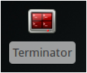

When you first select it you will not be running as root.

In order to become root simply run the commands below:

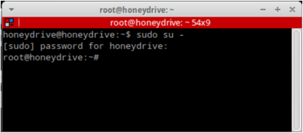

When it asks you for your password, please enter 'honeydrive'

Also, please do not use this VM in production unless you have changed
all default passwords.

Now, we need to start the Social Engineering Toolkit to create a
malicious website for Thug to analyze.

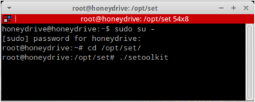

When SET starts, please choose the following options:

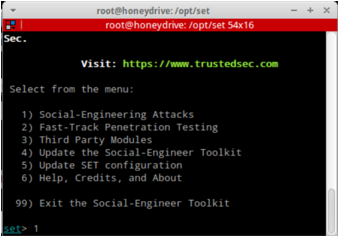

Social-Engineering Attacks

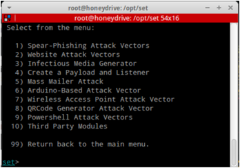

Website Attack Vectors

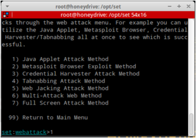

Java Applet Attack Method

Web Templates

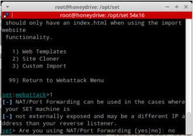

no

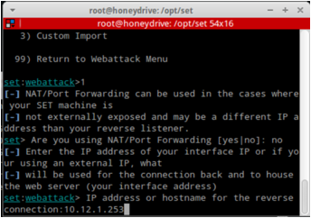

When it asks for your IP address please put your systems IP address.

It can be found by running 'ifconfig' in another terminal window.

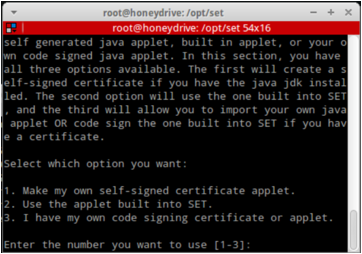

2

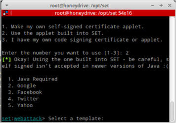

1

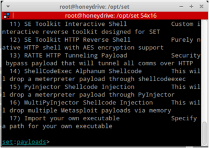

2

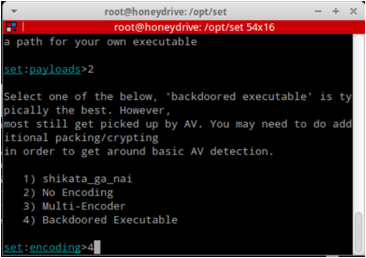

4

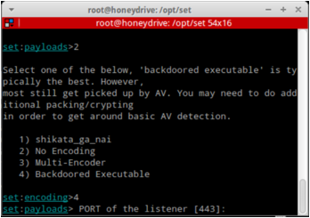

443 (The default, just hit enter)

Please note, it will take a while for Metasploit to start and the
payloads to be created. Please be patient. You may get an error on
database authentication with Metasploit. That is OK. We are not using
the Database for this lab.

Once you see the following, it is ready to go:

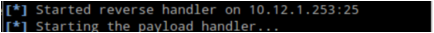

Now, open another Terminal window by clicking the icon below:

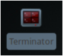

Then, navigate to the Thug directory:

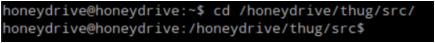

Then, run Thug against <http://127.0.0.1>

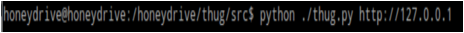

When thug runs, it creates a unique hash-based directory name for each
entry.

This can be confusing at first, but it makes sense when analyzing
multiple samples.

Lets see what directories where created. Please note, your hash values
may be different than the ones in this guide.

Lets navigate to the logs directory:

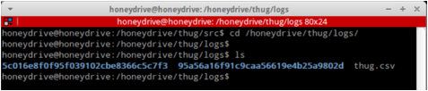

Now, we will look at the directory which starts with 5c016. You may have
a different hash directory. That is ok, simply select that if you wish.

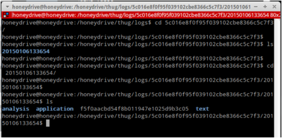

Please note there is an analysis, application and text directory.

Lets start in the analysis directory:

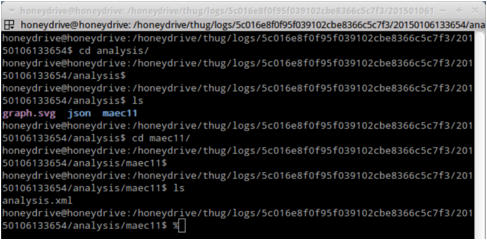

Once we entered the maec11 directory there is a file called
analysis.xml. This is a full breakdown of what Thug did and discovered
about the dangerous website. Lets take a look at the file with Firefox:

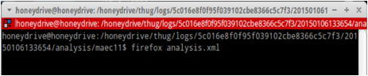

When it runs it will display the raw XML output. Firefox is nice for
reviewing this data as it color codes it.

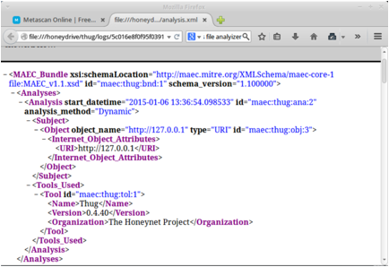

When you scroll down you will eventually see the following:

Notice, the PDF or JAR, Exploit Kit. This is exactly what we created.

Now, lets upload the Java Exploit kit to Metascan Online!

Please, open a browser and navigate to:

<https://www.metascan-online.com/en>

Then click on Select a File:

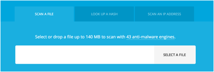

You will select the following path:

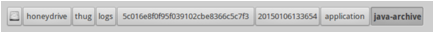

Then, select the file in the java-archive directory:

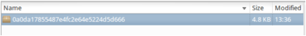

Once again, your hash values may be different.

When it is done running some AV engines will correctly detect the Java
App as malware:

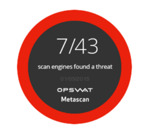

If you select the \java.class file you will see what the AV engines
detected:

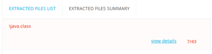

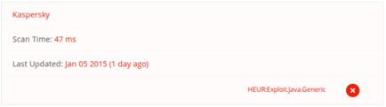

So, the main goal of this lab was to show you how to analyze potentially
dangerous sites without putting your own browser and network at risk.