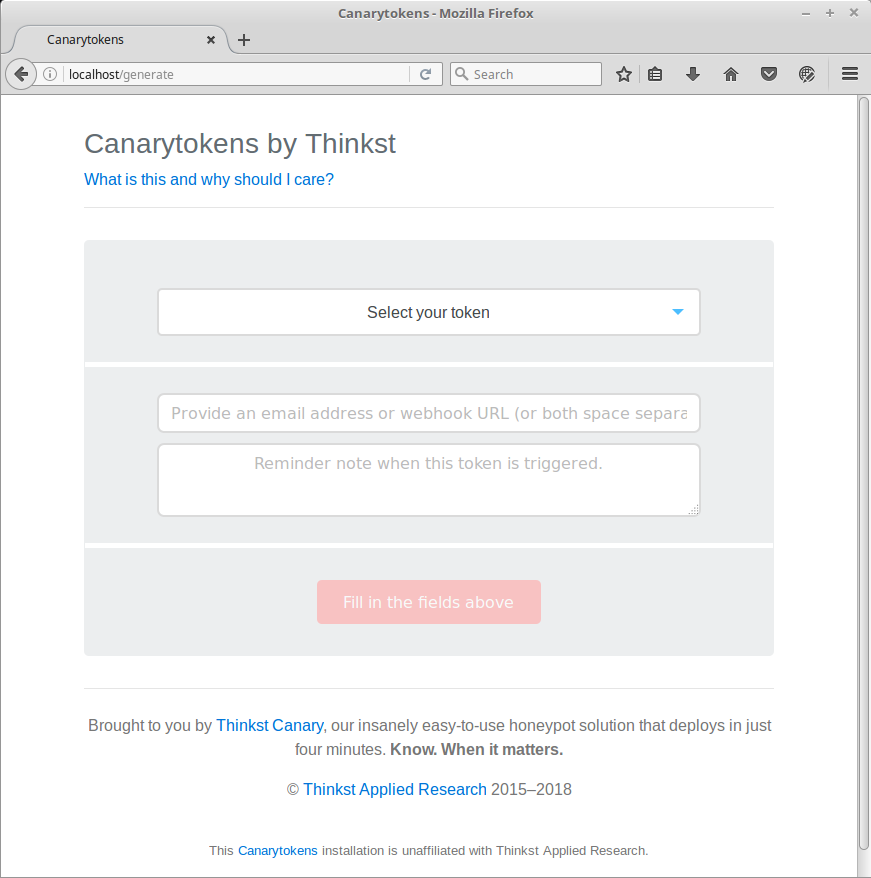
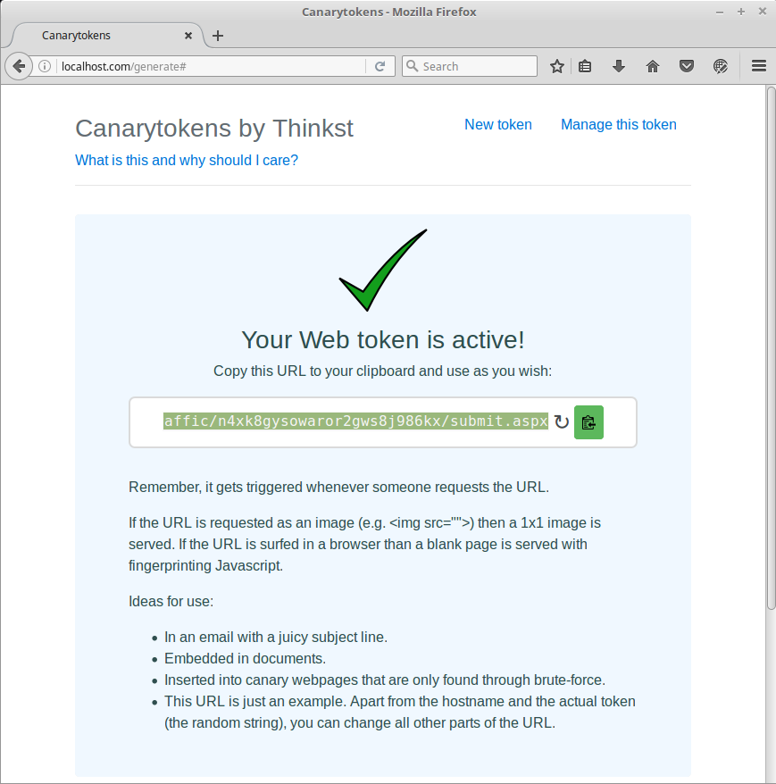
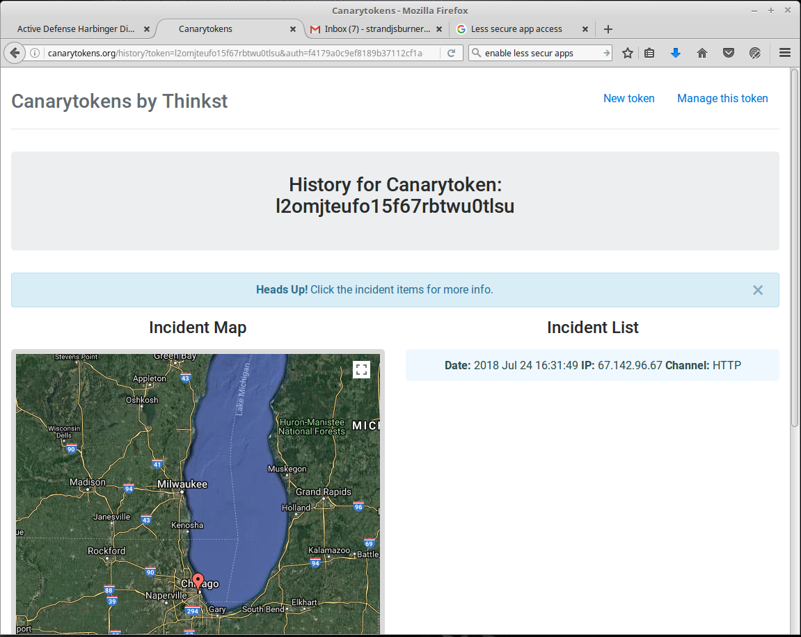

Canary Token Local HTML Demo
=======

Website
-------

<http://canarytokens.org/>

<https://github.com/thinkst/canarytokens-docker>

Description
-----------

Canary Tokens are outstanding objects that can beacon back when activated.  For example, you could create a Word document that calls back.  Or, in this example, a little snippet of HTML code that calls back whenever it is activated.

This can be used by loading this code into a part of your website that an attacker may visit or clone.  For example, a page in robots.txt that a user would never go to. Or, possibly, a fake webmail portal.  Either way, when the attacker visits or triggers the code, it will call back with the attackers IP address.

You can see a video here:

<https://www.youtube.com/watch?v=mDnaEmpO1C4>

MITRE Shield
------------

Applicable MITRE Shield techniques:
* [DTE0011](https://shield.mitre.org/techniques/DTE0011) - Decoy Content

Additional dependencies if not using SaaS deployment:
* [DTE0017](https://shield.mitre.org/techniques/DTE0017) - Decoy System
* [DTE0016](https://shield.mitre.org/techniques/DTE0016) - Decoy Process
* [DTE0034](https://shield.mitre.org/techniques/DTE0034) - System Activity Monitoring

----------------

`/opt/canarytokens-docker`

Example 1: Creating Callbacks Using Local Canary Instance
-------------------------------------------

First, change into the install directory.

`$` **`cd /opt/canarytokens-docker`**

Now, inside /opt/canarytokens-docker, we need to edit switchboard.env:

`$` **`nano switchboard.env`**

Find the line that says CANARY_PUBLIC_IP= and substitute your IP address
for whatever is there.  To save the changes, type ctrl+o, enter, and then
ctrl+x

Before we can start the app, we need to shut
down dnsmasq and apache and master.

`$` **`sudo killall dnsmasq`**

`$` **`sudo service apache2 stop`**

`$` **`sudo killall -9 master`**

Now we can start Canary with the following command:
`$sudo docker-compose up`

Next, browse to http://localhost/generate with Firefox and you will see the Canary user interface.

Now, lets create a "WebBug URL" token.

Select the drop-down and then select "WebBug URL Token":

Fill in `adhd@localhost.com` and `adhd` in the email and notes fields respectively.

Next, select "Create My Canary Token".

You should now be able to view and trigger to token.

Example 2: Creating Callbacks Using CanaryTokens.org
----------------------------------------------------
First, navigate to http://canarytokens.org with Firefox

Select "Microsoft Word Document" from the drop-down menu.

Add a real email address in the email field. This email address is used to receive notifications when the token is triggered.

Enter a message in the final box.

Click "Create my Canarytoken" when finished.

This will give you the option to download the document:

Click on the download button to download the document.

Next, email this document to a system running Microsoft Word:

When you receive the email, open it in Word. The document will be blank when you first open it, but the file can be renamed or modified if desired.

Once the document is open, go back to "canarytokens.org" and manage the token.

This will bring up the page that shows the document was opened, the IP, and the location of the IP address where the document was opened.

Now that you know the flow of creating tokens, Take a few moments and try creating and firing other tokens.  In particular, try this with a PDF!
