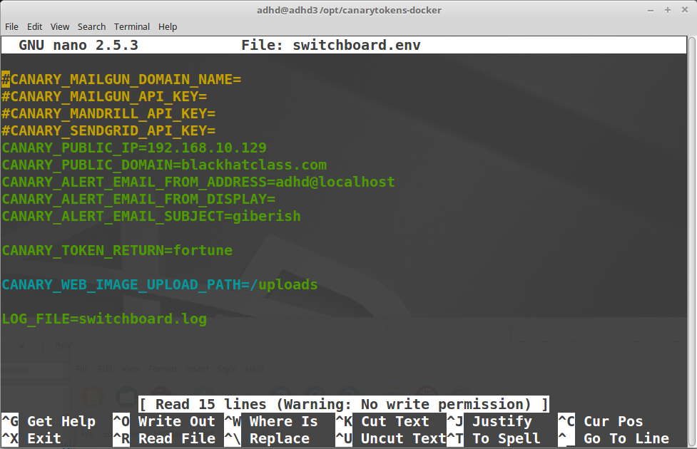
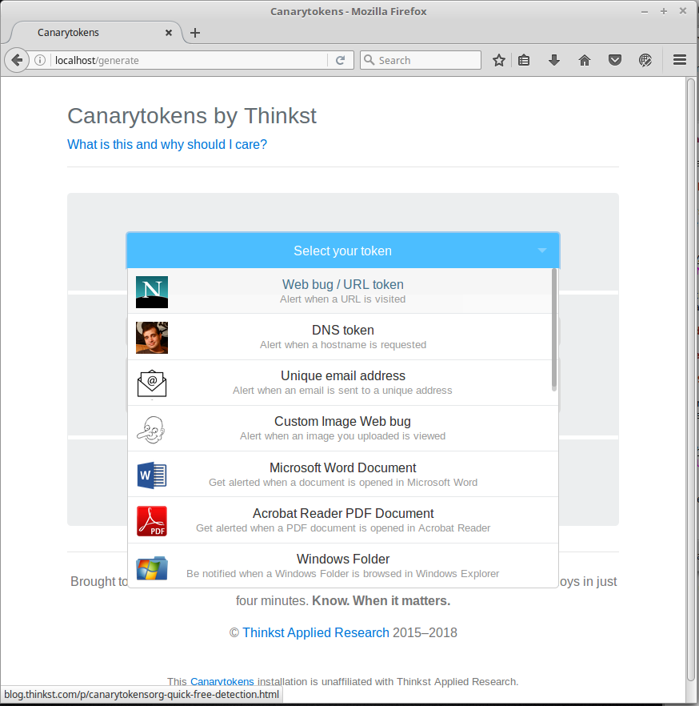
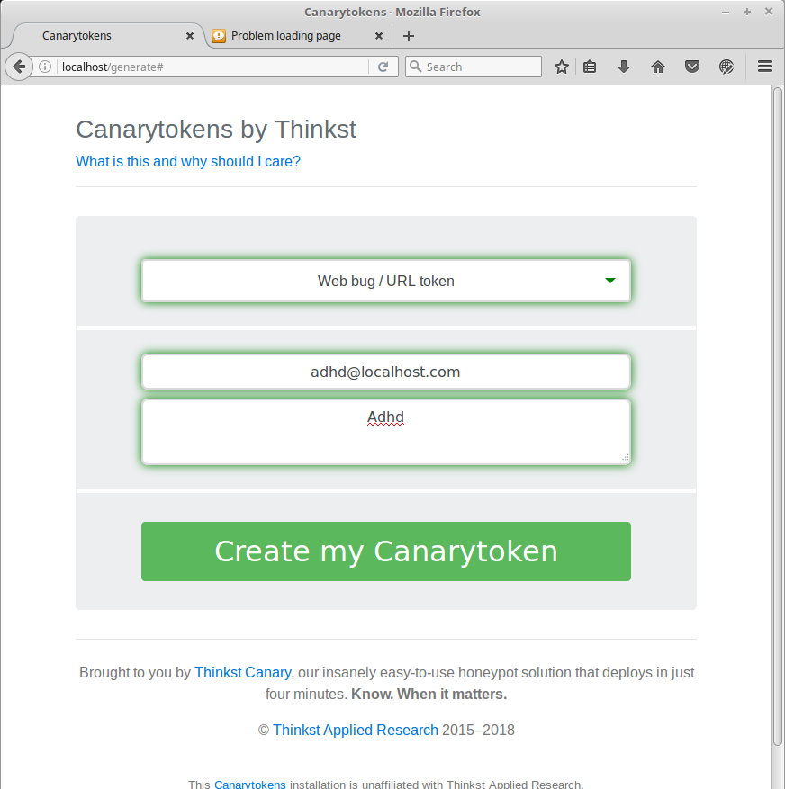

Canary Token Local HTML Demo
=======

Website
-------

<http://canarytokens.org/>

Description
-----------

Canary Tokens are outstanding objects that can beacon back when activated.  For example, you could create a Word document that calls back.  Or, in this example, a little snippet of HTML code that calls back whenever it is activated.

This can be used by loading this code into a part of your website that an attacker may visit or clone.  For example, a page in robots.txt that a user would never go to. Or, possibly, a fake webmail portal.  Either way, when the attacker visits or triggers the code, it will call back with the attackers IP address.

You can see a video here:

<https://www.youtube.com/watch?v=mDnaEmpO1C4>

----------------

`/opt/canarytokens-docker`

Example 1: Creating an HTML callback
-------------------------------------------

First, change into the instal directory.

`$` **`cd /opt/canarytokens-docker`**

Now, inside /opt/canarytokens-docker, we need to edit switch.env:

`$` **`nano switchboard.env`**

Find the line that says CANARY_PUBLIC_IP= and substitue your ip address
for whatever is there.  To save the changes, type ctrl+o, enter, and then
ctrl+x

Before we can start the app, we need to shut
down dnsmasq and apache and master.

`$` **`sudo killall dnsmasq`**

`$` **`sudo service apache2 stop`**

`$` **`sudo killall -9 master`**

Now we can start Canary with this command: $sudo docker-compose up
Next, in firefox browse to http://localhost/generator and you wil see
the Canary UI.

Now, lets create a WebBug URL token.

Select the dropdown and then select WebBug URL Token:

Please fill in adhd@localhost.com and adhd in the email and notes respectivily. Please note, we are not going to be using this.

Next select Create My Canary Token.

Now you should be able to view and trigger to token.

