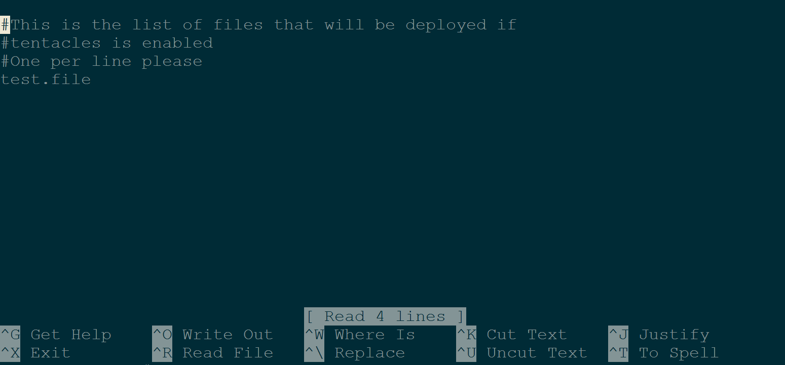
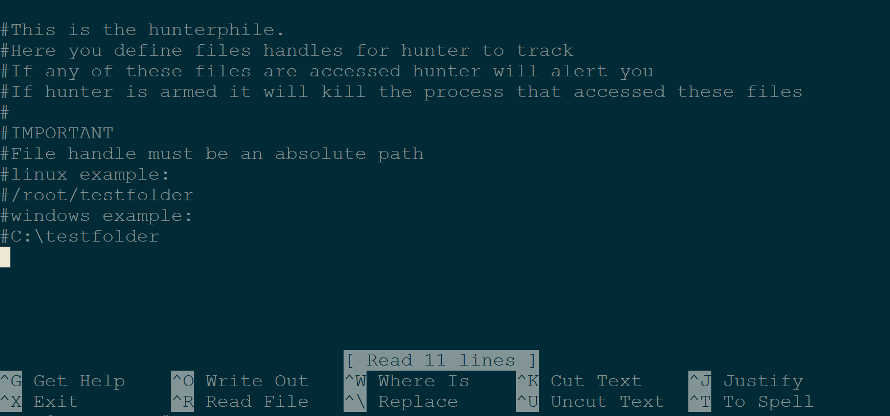

Cryptolocked-ng
===============

Website
-------

<https://github.com/prometheaninfosec/cryptolocked-ng>

Description
-----------

Cryptolocked-ng comes in two parts, the first part is a file system integrity failsafe called tentacles.  That is, it monitors your file system for 
unauthorized modification.  And will trigger failsafe countermeasures in the event of an 
unauthorized modification of your filesystem.

The current countermeasures include shutdown, email
alerts, and a simulated countermeasure (for testing purposes).

The second part of Cryptolocked-ng is huntr.  Huntr is a file handle based process hunter-killer.  It monitors your system's open file handles for signs of access to a tracked file.  If it detects such an access it kills the process that attempted it.

Cryptolocked was developed initially as a response to Crypto based ransomware like Cryptolocker.

Cryptolocked-ng uses tripfiles, special files that should never be otherwise modified or accessed.  It monitors 
these files for access, modification or destruction (depending on the module).  

Install Location
----------------

`/opt/cryptolocked-ng/`

Usage
-----

To run Cryptolocked-ng navigate to the install location and run the tool as follows.

`~$` **`cd /opt/cryptolocked-ng`**

`/opt/cryptolocked-ng$` **`sudo python2 ./cryptolocked-ng.py`**

This will start Cryptolocked-ng in basic, unarmed mode.  This means that only an alert will be sent, no other actions will be performed if a tripfile is accessed.

By default cryptolocked-ng will start running both the tentacles and the huntr modules.  But neither will be armed.

To trigger the simulated failsafe, either modify or delete the tripfile (test.file) located in the 
directory from which you ran Cryptolocked-ng.
Let's trigger the failsafe.

`/opt/cryptolocked-ng$` **`sudo rm -f test.file`**

Note in Example 4 that the script requires access to a gmail account. Some accounts will restrict this and Cryptolock will crash. To remove this restriction, log into the listening gmail account, go to [https://www.google.com/settings/security/lesssecureapps](https://www.google.com/settings/security/lesssecureapps), and 'Turn On' access for less secure apps.

Example 1: Debug Mode
---------------------
From here on out, we will be calling Cryptolocked-ng as root.
To su to root simply:
`~$` **`sudo su -`**

Now that you're root cd to the Cryptolocked-ng directory.

`~#` **`cd /opt/cryptolocked-ng`**

Cryptolocked-ng comes with a debug mode.  It is important to run this debug mode before arming the tool.  
Debug mode is run to make sure that there are no file permission errors or other such things that 
may cause an unnecessary triggering of the failsafe.

To debug Cryptolocked-ng simply add the argument "--debug" when calling the program from the command line.

`/opt/cryptolocked-ng#` **`python2 ./cryptolocked-ng.py --debug`**

        Checking if file exists:        True
        Checking if file created:       True
        Checking if file written:       True
        Checking if file destroyed:     True
        If all "True" functionality is good

Example 2: Arming Cryptolocked-ng
---------------------------------

Cryptolocked-ng starts unarmed by default.  This is to make sure that if using destructive or 
dangerous countermeasures, you must explicitely activate them.

To arm Cryptolocked-ng simply add the argument "--armed" when calling the program from the command line.

`/opt/cryptolocked-ng#` **`python2 ./cryptolocked-ng.py --armed`**

        Checking if tripfile test.txt exists:        False
        tripfile Instantiated

Now, if a tentacles tripfile is modified or destroyed, the countermeasures selected inside of the file 
(cl.conf) via configuration will be executed.  By default, this will be to shutdown your 
system to prevent further tampering.

If a huntr tracked file is accessed, the process that accessed it will be terminated.

Example 3: Cryptolocked-ng's Tentacles
-----------------------------------

By default Cryptolocked-ng only deploys one tripfile (test.file).  This can be remedied by editing the file **tentacles.lst** and adding more files for it to track.

`/opt/cryptolocked-ng#` **`nano tentacles.lst`**

You can add one file per line.  You can specify them with absolute files paths such as '/root/secrets.txt' or '/var/www/passwords.txt' in order to spread them throughout the file system to entice an adversary.

If using Nano, you can save your changes with Ctrl+O followed by the enter key.

Then exit Nano with Ctrl+X.

Now, when you launch Crptolocked-ng it will create and monitor more files for modification or destruction.

If one of the tracked files is modified or destroyed the failsafe countermeasures will be activated.

Example 4: Cryptolocked-ng's Huntr
----------------------------------

Cryptolocked-ng's Huntr module is a file handle based process hunter-killer.  It watches your OS for access to any tracked files via file handle.  If it detects a process with a file handle for a tracked file it will kill that process.

Due to the polling time of the tool, the best types of file handles to track are directories/folders.  If a process moves into a tracked folder to perform some function for even a brief period of time, it is likely to be detected and neutralized.

You can edit the file **huntr.lst** and add more files for huntr to track.  Simply add one per line; or use one of the available OS specific examples.  Keep in mind that the file handle **must** be an absolute path.

`/opt/cryptolocked-ng#` **`nano huntr.lst`**

If using Nano, you can save your changes with Ctrl+O followed by the enter key.

Then exit Nano with Ctrl+X.

Example 5: Email Alerts
-----------------------

In addition to shutting the system down in the event of failsafe activation Cryptolocked-ng can email 
you to notify you of the event.

To configure email alerts you will need at least one gmail account.

Open the file /opt/cryptolocked-ng/cl.conf

Modify these lines with the credentials and address to the gmail account:

        fromaddr: user@gmail.com
        username: username
        password: password

Next you will add the "**to**" address, this can be the same address as the "**from**" but 
doesn't have to be:

        toaddr: user@domain.com

To activate email alerts, simply change this line from `False` to `True`:

        alerts_enabled: False

Finally, you may choose to send, or withhold potentially sensitive operating system information:

        sensitive_alerts: True

(True is the default, set to False if you are dealing with a sensitive system and 
do not want OS details in your email.)

Save your changes, and the next time you launch Cryptolocked-ng it will be ready to alert you of any malicious activity.
