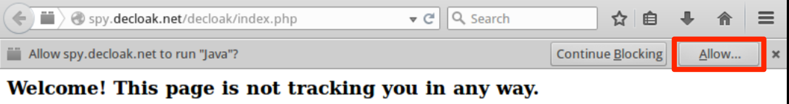
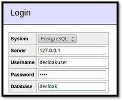

Decloak
=======

Website
-------

<http://decloak.net/>

Description
-----------

Used to identify the real IP address of a web user, regardless of proxy 
settings, using a combination of client-side technologies and custom services.

Install Location
----------------

`/opt/decloak/`

`/var/www/decloak/`

Example 1: Compiling Flash and Java Objects
-------------------------------------------

Note: This exercise is optional as the files generated here already exist.

Decloak uses both a Flash object and a Java applet and provides them both
precompiled. You can likely skip this example and Decloak will function
just fine. If you need or want to compile the objects yourself for some
reason, the steps are detailed below.

First, change to the decloak directory, and move the precompiled objects
so they don't get in the way.

`/opt/decloak$` **`mv Decloak.swf Decloak.swf.bak`**

`/opt/decloak$` **`mv HelloWorld.class HelloWorld.class.bak`**

Here is the command to compile the Flash object. The source code is
actually written using the Haxe programming language so you must use the
haxe compiler. You should end up with a newly created Decloak.swf in the
decloak directory.

`/opt/decloak$` **`haxe -main Decloak.hx -swf Decloak.swf -swf-version 10`**

This compiles the swf for the latest version of Flash. Haxe with the
-swf-version switch supports compiling by targeting Flash versions 6
through 10. To change the target version just change the argument to the
-swf-version switch. For versions 9 or 10 use the Decloak.hx source
file. For versions 6 through 8 you must first rename Decloak.hx to
something else, and rename Decloak.flash8.hx to Decloak.hx.

`/opt/decloak$` **`mv Decloak.hx Decloak.flash10.hx`**

`/opt/decloak$` **`mv Decloak.flash8.hx Decloak.hx`**

`/opt/decloak$` **`haxe -main Decloak.hx -swf Decloak.swf -swf-version 8`**

To compile the Java applet, the commands are as follows.

`/opt/decloak$` **`javac -cp /usr/share/icedtea-web/plugin.jar HelloWorld.java`**

You should now have a newly created HelloWorld.class file in the decloak
directory. You will need to copy these files to the decloak web
directory.

`/opt/decloak$` **`sudo cp HelloWorld.class /var/www/decloak/`**

`/opt/decloak$` **`sudo cp Decloak.swf /var/www/decloak/`**

Example 2: Setting Up the Decloak DNS Server
--------------------------------------------

The backbone of Decloak is a custom DNS server that listens for
specially formatted connections. It logs these connections to a
database.

In order to start Decloak's DNS server, first change into the **/opt/decloak** directory.

`/opt/decloak$` **`sudo ./dnsreflect.pl`**

This will run dnsreflect.pl in the background.

Example 3: Browsing to a Decloak Activated Website
--------------------------------------------------

You will be using the ADHD machine to visit the website. You need to
follow [Example 2: Setting Up the Decloak DNS Server] before completing 
the steps below. 

Note: Setting up a domain name and DNS server settings for the 
Decloak server is beyond the scope of this example, but to simulate this
ADHD has a local entry for **spy.decloak.net** in its **/etc/hosts** file.

Open your web browser and enter
[http://spy.decloak.net/decloak/index.php](http://spy.decloak.net/decloak/index.php)
into the address bar. You will be connected to the Decloak webpage which
uses your browser's built in HTML rendering, along with both Java and
Flash plugins in an attempt to gather your IP address. 

In order for the Java and Flash plugins to run in newer versions of Java and Firefox, 
you will need to first tell the browser to allow both to run.

Be sure to select one of the "allow" options here.

You will then need to tell the Java applet to "run".

Note: Since this is an unsigned applet, newer versions of Java will not allow it to
run even if the Java plugin is allowed. In a real-world situation, this would be 
taken care of by purchasing a legitimate code-signing certificate and signing the 
applet. But within the ADHD environment we have instead added "http://spy.decloak.net"
to the Java applet site exception list, which allows unsigned and self-signed applets
to run from this domain. You can view this setting by going to:
Menu -> Internet -> Oracle Java7 webstart -> Security tab -> Site Exceptions List

Different techniques are used in an attempt to bypass any anonymizing proxy: 
DNS via an embedded image in the web page, UDP via Java, DNS via Java, and TCP via Flash.
Even if only one of these ignores the proxy settings, we will have the target's real
IP address, source port, and a timestamp, which we can use to locate the individual.

Example 4: Viewing the Decloak Database
---------------------------------------

Decloak automatically stores the information it gathers in a database.
To view the data, open your browser and go to
[http://127.0.0.1/adminer/](http://127.0.0.1/adminer/), change the
database to `PostgreSQL`, and use `127.0.0.1`, `decloakuser`, `adhd`,
and `decloak`, for the server, username, password, and database
respectively.

Next, select the `requests` table, and then click `Select data` to view
the entries in the database table.

 

From here you should be able to see the entries just added from your
visit to the Decloak webpage.

Since you connected from the same machine, the IP addresses Decloak
collected should read 127.0.0.1. Those are not very interesting, but a
real-world scenario requires changing the DNS settings for a domain you
own and is beyond the scope of this document.

Example 5: Tearing Down the Decloak DNS Server
----------------------------------------------

To undo everything done in [Example 2: Setting Up the Decloak DNS Server] you'll need to kill the DNS server.

`$` **`sudo pkill dnsreflect`**