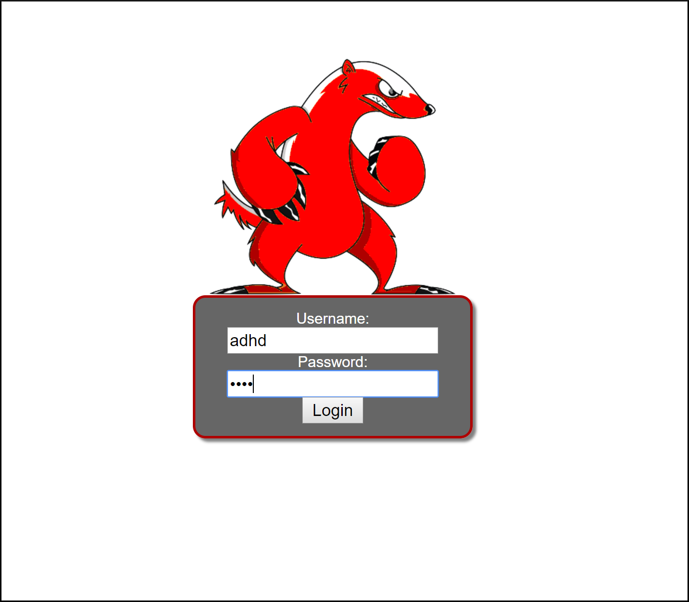
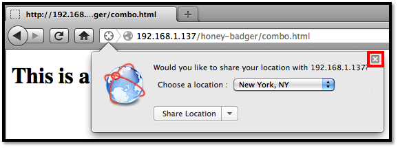
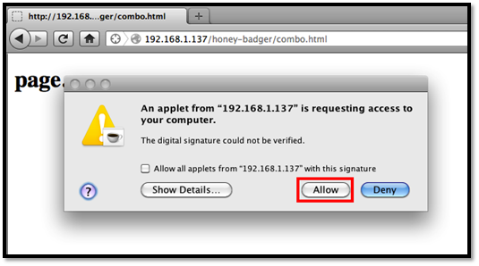
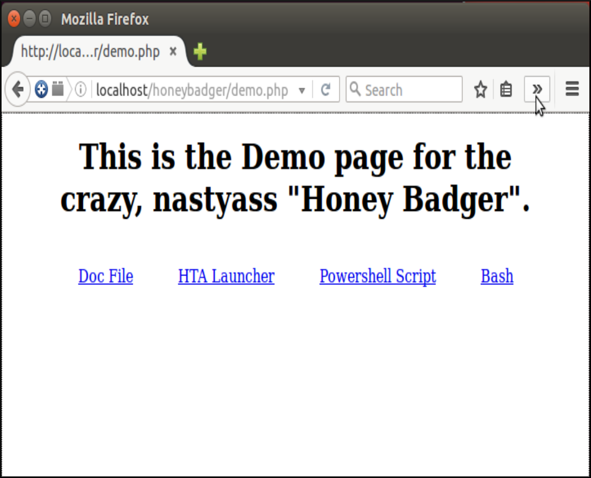
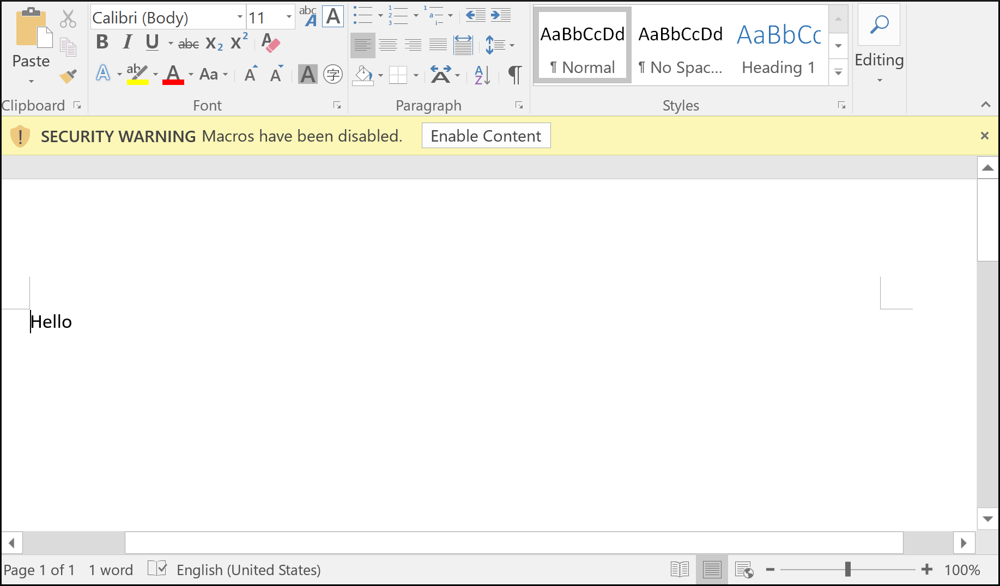

Honey Badger: Red Edition
=========================

Website
-------

<https://github.com/prometheaninfosec/honeybadger-red>

Description
-----------

Used to identify the physical location of a web user with a combination
of geolocation techniques using a browser's share location feature, the
visible WiFi networks, and the IP address.

Updates
-------

Honeybadger Red Edition contains a number of fresh additions to the venerable frameowrk.  Chief among them being support for new agents, as well as new data collection strategies.

* New Agents!
* New Data Encodings!
* New Swagger!
* New .htaccess file!
* New Dependencies!
* New Network Profile Stealing Capabilities!

More sure to be added soon!

Install Location
----------------

`/var/www/adhd/honeybadger/`

Usage
-----

Visit [http://127.0.0.1/honeybadger/demo.php](http://127.0.0.1/honeybadger/demo.php) to log your location.

Visit [http://127.0.0.1/honeybadger/index.php](http://127.0.0.1/honeybadger/index.php) to view the connection map.

Video Walkthrough
-----------------

<video controls>
  <source src="Videos/1_550_HoneyBadger.mp4">
  <source src="https://onedrive.live.com/download.aspx?cid=8D6C4317A39E3D29&resid=8D6C4317A39E3D29%2155673&canary=">
 
Your browser does not support html5 video.

</video>

Example 1: Web Browser Share Location
-------------------------------------

Open the web browser and enter [http://127.0.0.1/honeybadger/demo.php](http://127.0.0.1/honeybadger/demo.php)
into the address bar. This address is also available as a link by visiting [http://127.0.0.1/](http://127.0.0.1/) 
and clicking `Honey Badger (Location Tracker)`.

Honey Badger will then attempt to gather your location using a variety of
techniques. First, it uses the web browser's built in location sharing
functionality. The web browser will first prompt you whether or not to
share your location with Honey Badger.
Click "Share Location."

That's it. Honey Badger has now logged your location. Go to
[Example 3: Viewing the Honey Badger Map] to find how to view the
location Honey Badger gathered.

Example 2: Creating a Honey Badger User
---------------------------------------

Before you can view the data Honey Badger has collected you will need to create a user. 
Creating a user in Honey Badger is super simple.

Change into the Honey Badger admin directory

`~$` **`cd /var/www/adhd/honeybadger/admin`**

Now run create_user.py and follow the prompts to create a new administrative user.
Make sure to sudo this next command!

NOTE: There is probably already a user by the name adhd as this is the default user for this distro.  You may want to create a user with a different name and password.  Or change this user's password by deleting it and recreating it with a new password.

`/var/www/adhd/honeybadger/admin$` **`sudo ./create_user.py`**

        Username: adhd 
        Password: adhd
        User Role Options:
        0 - Administrator
        1 - User
        Role: 0
        Salt: rWeKE
        Hash: 6de86dd5a8a5e3309c1c9587d44a337b1cfd523d
        [!] Database not initialized.

For this example I created a user named **adhd** with password **adhd**
I also made this user an administrator.  Honey Badger administrators are given permissions to 
purge the database and logs from within the Honey Badger interface.

Now that you have created a user, you are ready to proceed onto 
[Example 3: Viewing the Honey Badger Map].

        
Example 3: Viewing the Honey Badger Map
---------------------------------------

Note: Before you are able to view the honeybadger map you will need a Google Maps API key.  There is one that comes with Honeybadger-red.  HOWEVER, if you choose to get one for yourself: You can get an API key here: https://developers.google.com/maps/documentation/javascript/get-api-key  --> Simply put that key in the top of badger.php where it says $API="".

Open the web browser and enter
[http://127.0.0.1/honeybadger/badger.php](http://127.0.0.1/honeybadger/badger.php)
into the address bar. This address is also available as a link by
visiting [http://127.0.0.1/](http://127.0.0.1/) and clicking "Honey Badger (Reporting)."

Use your credentials on the login screen to authenticate.

After you log in with the username and password we created in 
[Example 2: Creating a Honey Badger User] you will be taken to the reporting page.

The reporting page contains a map showing the locations that Honey Badger has logged.  You can select your target from the dropdown menu on the left.

Honey Badger keeps track of each connection and displays one at a time on the map. To choose a 
different connection than the one shown, click on the drop-down menu and select another entry.

NOTE: Obviously there's not going to be anything there if you haven't logged any connection attemps yet.  Try using the techniques in the other examples to get some data logged. Then check back here.

Example 4: Using Java to Find Nearby Wireless APs
-------------------------------------------------

NOTE: Support for Java Applets has been waning across the internet as of late.  If you can't get this technique to work, try some of the new agents below.

What happens if you follow [Example 1: Web Browser Share Location], but you decide not 
to share your location?  Honey Badger has another way to discover your physical
location if your machine has Java installed and an active wireless card.
First, find the IP address of the ADHD machine. The assumption here is
that you will be connecting to it from within a local network.

`$` **`ifconfig`**

        eth0    Link encap:Ethernet  HWaddr 00:0c:29:6c:14:79
                inet addr:192.168.1.137  Bcast:192.168.1.255  Mask:255.255.255.0
                inet6 addr: fe80::20c:29ff:fe6c:1479/64 Scope:Link
                UP BROADCAST RUNNING MULTICAST  MTU:1500  Metric:1
                RX packets:136005 errors:0 dropped:0 overruns:0 frame:0
                TX packets:59528 errors:0 dropped:0 overruns:0 carrier:0
                collisions:0 txqueuelen:1000
                RX bytes:146777599 (146.7 MB)  TX bytes:7955605 (7.9 MB)
                Interrupt:19 Base address:0x2000
                
        lo      Link encap:Local Loopback
                inet addr:127.0.0.1  Mask:255.0.0.0
                inet6 addr: ::1/128 Scope:Host
                UP LOOPBACK RUNNING  MTU:16436  Metric:1
                RX packets:12930 errors:0 dropped:0 overruns:0 frame:0
                TX packets:12930 errors:0 dropped:0 overruns:0 carrier:0
                collisions:0 txqueuelen:0
                RX bytes:3413486 (3.4 MB)  TX bytes:3413486 (3.4 MB)

In this case the IP address for the machine is 192.168.1.137. Now, from
another machine that has an active wireless card and Java installed,
connect to <http://192.168.1.137/honeybadger/demo.php>.

Honey Badger will attempt to gather your
location using a variety of techniques. First, it uses the web browsers
built in location sharing functionality. The web browser will
prompt you whether or not to share your location with Honey Badger.
Instead of accepting, click the 'x' to close the prompt so that the Java 
technique will run.

Honey Badger will then attempt to gather your location by means of a
Java applet. After a short time you will be prompted whether you want to
allow the applet to access the computer. Click "Allow."

Since the applet requires a high level of access to the local machine,
Java first prompts the user to allow access.

That's it. If successful, Honey Badger has now logged your location. Go
to [Example 3: Viewing the Honey Badger Map] to find how to view the
location Honey Badger gathered.

Example 5: Red Edition Updates
------------------------------

A number of additions have been made to bring Honeybadger back to full fighting form.  

For starters there is now a .htaccess file.  As long as your site configuration allows htaccess overrides, everything you need to keep the honeybadger install safe should be set.  Honeybadger has a few security needs that have to be implemented at the level of the web service.  For example, you shouldn't be able to just download the database without authenticating and reading the data through the app.  An attacker could potentially do this if the web server is not configured to disallow it.  Those configurations can be made in Apache at the level of the virtual host, or in this case, with an htaccess file.

You can test whether or not this is working by attempting to visit the a disallowed resource.  like [admin/vhost_config.txt](http://localhost/honeybadger/admin/vhost_config.txt) from your web browser.  If you see anything other than a 404 error, something is wrong.

There are also some new agents.  You can check out the agents by navigating to the folder admin/agents from a console on your webserver.  

Honeybadger is now able to handle multiple types of encodings.  You can specify the encoding type that the agent will be using in the call to service.php using the parameter "decode" (current choices are base64 and hex).

The new agents are also gaining new capabilities (pulling stored network profiles) more will be added in time.  

Example 6: Powershell Via HTA
-----------------------------

Honeybadger now has a powershell based agent.  As of the latest updates there are also two stagers for the powershell agent, an HTA launcher, and a word macro.  Herre we'll discuss the HTA launcher.

But first, what is an HTA?  This rather obscure executable type is an "HTML Application"; which is described as a "Microsoft Windows program whose source code consists of HTML, Dynamic HTML, and one or more scripting languages" (Wikipedia).  Simply put, it's a rare executable format.

You'll find a link to download the HTA agent on Honeyadger's demo page.

Assumedly, you'll be running Honeybadger on some type of Linux host.  The HTA format is an agent designed to target only Windows machines.  So you'll need to navigate to Honeybadger from a remote windows host.  The specifics of how this will be accomplished are entirely dependent on your particular setup.

In general though, if the Honeybadger instance and Windows machine are on the same network, all you'll need to do is run **`ifconfig`** on the machine serving Honeybadger to grab it's IP.  Then navigate to <honeybadger_ip>/honeybadger/demo.php

Then click "HTA Launcher" to download the HTA.

NOTE: Depending on your web browser you might see different warning messages.  Click through all of them.

Click "Run" to launch the HTA.

After a moment you should see a window like this pop up.

That's it.  Wait a few seconds and close the window.  
In the background, the HTA has downloaded and executed Honeybadger's powershell agent.  To view the gathered results, head over to [Example 3: Viewing the Honey Badger Map].

Example 7: Powershell Via Macro
-------------------------------

Another option that the new Honeybadger has, is the ability to user a word doc macro to stage the powershell script.  Word macros allow the execution of code from within a word document.  In this case the macro embedded into the Honeybadger docm agent will connect back to the Honeybadger service, pull down and execute the powershell script that gathers location data and sends it once again, back to the service.

To get the document, simply navigate as before (In example 6) to the demo page.  

This time, click "Doc File".  Your browser should download and open the document.

If word opens the document up in protected view, click "Enable Editing".

You may also need to click "Enable Content"; a deceptively benign button press.

That's it.  You might notice a powershell window open on your taskbar, before fading away after a few seconds.  Your location has been transmitted back to the Honeybadger server.  To view the data use the process from [Example 3: Viewing the Honey Badger Map].
