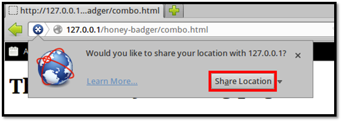

Honey Badger
============

Website
-------

<https://github.com/LaNMaSteR53/honeybadger>

Description
-----------

A framework used to identify the physical location of a web user with a combination
of geolocation techniques such as using a browser's share location feature, the
visible WiFi networks, and the IP address.

Particularly effective at unmasking remote attackers, and pinpointing their exact location.

Install Location
----------------

`/opt/honeybadgerv2`

Usage
-----

Video Walkthrough
-----------------

<iframe src="https://onedrive.live.com/embed?cid=8D6C4317A39E3D29&resid=8D6C4317A39E3D29%2155673&authkey=AM_U5oxKFN3Tc8k" width="320" height="180" frameborder="0" scrolling="no" allowfullscreen sandbox="allow-scripts allow-pointer-lock allow-forms allow-same-origin"></iframe>

Example 1: Web Browser Share Location
-------------------------------------

Open the web browser and enter [http://127.0.0.1/honeybadger/demo.php](http://127.0.0.1/honeybadger/demo.php)
into the address bar. This address is also available as a link by visiting [http://127.0.0.1/](http://127.0.0.1/)
and clicking `Honey Badger (Location Tracker)`.

Honey Badger will then attempt to gather your location using a variety of
techniques. First, it uses the web browser's built in location sharing
functionality. The web browser will first prompt you whether or not to
share your location with Honey Badger.
Click "Share Location."

First, the web browser will ask whether or not to share your location.

That's it. Honey Badger has now logged your location. Go to
[Example 3: Viewing the Honey Badger Map] to find how to view the
location Honey Badger gathered.

Example 3: Viewing the Honey Badger Map
---------------------------------------

Note: Before you are able to view the honeybadger map you will need a Google Maps API key.  You can get an API key here: https://developers.google.com/maps/documentation/javascript/get-api-key  --> Simply put that key in the top of badger.php where it says $API="".

Open the web browser and enter
[http://127.0.0.1/honeybadger/badger.php](http://127.0.0.1/honeybadger/badger.php)
into the address bar. This address is also available as a link by
visiting [http://127.0.0.1/](http://127.0.0.1/) and clicking "Honey Badger (Reporting)."

After you log in with the username and password we created in
[Example 2: Creating a Honey Badger User] you will be taken to the reporting page.

The reporting page will contain a map showing the locations that Honey Badger has logged.

Honey Badger keeps track of each connection and displays one at a time on the map. To choose a
different connection than the one shown, click on the drop-down menu and select another entry.

NOTE: Obviously there's not going to be anything there if you haven't logged any connection attemps yet.  Try using the techniques in Example 1 or Example 4 to get some data logged. Then check back here.

Example 4: Using Java to Find Nearby Wireless APs
-------------------------------------------------

What happens if you follow [Example 1: Web Browser Share Location], but you decide not
to share your location?  Honey Badger has another way to discover your physical
location if your machine has Java installed and an active wireless card.
First, find the IP address of the ADHD machine. The assumption here is
that you will be connecting to it from within a local network.

`$` **`ifconfig`**

        eth0    Link encap:Ethernet  HWaddr 00:0c:29:6c:14:79
                inet addr:192.168.1.137  Bcast:192.168.1.255  Mask:255.255.255.0
                inet6 addr: fe80::20c:29ff:fe6c:1479/64 Scope:Link
                UP BROADCAST RUNNING MULTICAST  MTU:1500  Metric:1
                RX packets:136005 errors:0 dropped:0 overruns:0 frame:0
                TX packets:59528 errors:0 dropped:0 overruns:0 carrier:0
                collisions:0 txqueuelen:1000
                RX bytes:146777599 (146.7 MB)  TX bytes:7955605 (7.9 MB)
                Interrupt:19 Base address:0x2000

        lo      Link encap:Local Loopback
                inet addr:127.0.0.1  Mask:255.0.0.0
                inet6 addr: ::1/128 Scope:Host
                UP LOOPBACK RUNNING  MTU:16436  Metric:1
                RX packets:12930 errors:0 dropped:0 overruns:0 frame:0
                TX packets:12930 errors:0 dropped:0 overruns:0 carrier:0
                collisions:0 txqueuelen:0
                RX bytes:3413486 (3.4 MB)  TX bytes:3413486 (3.4 MB)

In this case the IP address for the machine is 192.168.1.137. Now, from
another machine that has an active wireless card and Java installed,
connect to <http://192.168.1.137/honeybadger/demo.php>.

Honey Badger will attempt to gather your
location using a variety of techniques. First, it uses the web browsers
built in location sharing functionality. The web browser will
prompt you whether or not to share your location with Honey Badger.
Instead of accepting, click the 'x' to close the prompt so that the Java
technique will run.

Honey Badger will then attempt to gather your location by means of a
Java applet. After a short time you will be prompted whether you want to
allow the applet to access the computer. Click "Allow."

Since the applet requires a high level of access to the local machine,
Java first prompts the user to allow access.

That's it. If successful, Honey Badger has now logged your location. Go
to [Example 3: Viewing the Honey Badger Map] to find how to view the
location Honey Badger gathered.

