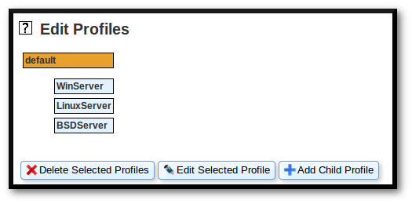
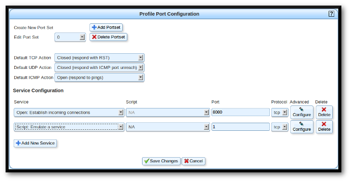
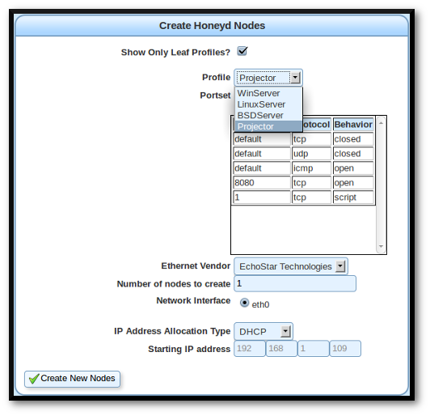
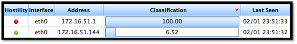

Nova
====

Website
-------

[http://www.projectnova.org/](http://www.projectnova.org/)

Description
-----------

Nova is an open-source software tool developed to detect network based
reconnaissance efforts, to deny the attacker access to real network data
while providing false information regarding the number and types of
systems connected to the network.

Nova prevents and detects snooping by setting up a large net of
realistic virtualized decoys. Trying to find the real machines then
becomes like trying to find a needle in a haystack. Meanwhile, Nova
identifies the attackers by their inevitable suspicious activity in
communicating with decoys, and provides the network administrators a
situation awareness view of their network.

Install Location
----------------

`/usr/share/nova`

Video Walkthrough
-----------------

<video controls>
  <source src="Videos/1_550_NOVA.mp4">
  <source src="https://onedrive.live.com/download.aspx?cid=8D6C4317A39E3D29&resid=8D6C4317A39E3D29%2155665&canary=">
 
Your browser does not support html5 video.

</video>

Example 1: Starting Nova
------------------------

Start the web interface from any directory with the command:

`$` **`quasar`**

Note: Nova will not start as root, you must run it as a limited user.
However, when ADHD is installed to a hard drive some people have experienced
errors when starting the packet classifier in later steps.  If you experience
similar issues, try running quasar as root.

Then open the web browser on your Linux machine and surf to
**https://127.0.0.1:8080** (note the 's' on 'https'). Nova uses a
self-signed certificate so you will be presented with an SSL certificate
warning. Click "I Understand the Risks". Then click the "Add Exception"
button and the "Confirm Security Exception" button in the resulting
pop-up.

Once you have accepted the certificate you should be prompted to login.
Do so with the following username and password respectively: 'nova' and
'toor'.

When you first login, Nova will ask if you wish to run a configuration
wizard. Choose "No." You should then see Nova's main page informing you
the Packet Classifier is not running. Click the "Start Packet
Classifier" button located near the top of the page to have Nova start
doing its thing.

Shortly after starting the Packet Classifier you should see IP addresses
start to appear in the grid. Notice that each of them already has a
number in its classification bar. Hopefully they are all relatively low
numbers at this point.

Example 2: Setting up Your Haystack
-----------------------------------

Nova comes with a default haystack configuration that will start 3
different honeypots for you. If you want to go ahead and just use the
defaults you can just click the "Start Haystack" button now and skip the
rest of this example, which walks you through adding a custom honeypot
to the haystack.

First, click on "Haystacks" in the toolbar on the left side of
the window. This will bring up a frame showing "Haystacks", "Profiles",
"Nodes", and "Scripts." Select the "Profiles" tab.

Click "default" to select it and then click the "Add Child Profile"
button.

This is the page where you can get creative. You can try and make
something believable, or you can make something that sticks out like a
sore thumb and will keep an attacker scratching his head for quite a while trying to 
come up with an explanation for what he's seeing.

Give your profile a name and uncheck the "Inherit?" box next to
"Operating System Personality." Here's where you can find some fun
devices to impersonate. You can either scroll through the list or start
typing in the box and see what comes up. Try typing "Nintendo", "Sony
Playstation", or "Microsoft Xbox" for some fun ones! Feel free to change your 
"Ethernet Vendor" as well.

Next, we need to give our honeypot some open ports. Click on "Add Portset."

Click the "Add New Service" for as many ports as you wish your honeypot to
have behaviors for. Type in the port number and configure each one as
you desire. You can make a port appear Closed, Filtered, Open, or even
have it execute a Script when someone connects to it. However you want
your honeypot to respond when an attacker interacts with it is up to you.

When you are finished, scroll to the bottom and click "Save Changes."

Now that you've created your profile, you need to add a new node that
uses it. To start, select the "Nodes" tab, look down and click the "Add New Nodes" button.

Select your new Profile from the drop-down menu. The Portset and
Ethernet Vendor should be automatically selected for you. Then click the
"Create New Nodes" button and you should see a fourth node with your profile 
added to the current configuration.

To complete the haystack setup, use the "Start Haystack" button at the
top of the Nova page to get it up and running. The "Haystack Status"
indicator should go from "Offline" to "Online." Then click the "Packet
Classifier" entry in the left side menu to view the table of hosts again.

Example 3: Running Nmap
-----------------------

For this example, you will need another machine with nmap installed. A
Windows version is supplied on ADHD for you to download and install if
you wish. It can be found in the web directory
http://\<ADHD\_IP\>/windows\_tools/. If you are running on Windows, you
will also need to install WinPcap, which is included in the nmap zip
file.

On your other machine, open a command prompt and change into your nmap
directory and execute the scan with the command below. The -O (that's a
letter 'oh' not a 'zero') tells nmap to perform operating system
detection. We want to see if nmap will detect the honeypots as running
the operating systems we configured them as. The -F tells nmap to only
scan the top 100 ports for any host it discovers. You will need to
replace the IP address in the command with the IP address for your ADHD
machine. The /24 after the IP address tells nmap to scan the entire
network your ADHD machine is running on. This example assumes you have a
fairly standard network set up with a netmask of 255.255.255.0. If yours
varies, you may want to change the command accordingly. Chances are the
scan will work just fine as is.

Note: The nmap output is abbreviated to highlight the OS detection
results. Your output will be longer and different.

`$` **`nmap -O -F 172.16.51.144/24`**

        Nmap scan report for 172.16.51.145
        Aggressive OS guesses: FreeBSD 8.2-STABLE (91%)
        Nmap scan report for 172.16.51.147
        Aggressive OS guesses: Linux 2.6.32 - 3.6 (97%)
        Nmap scan report for 172.16.51.146
        Running (JUST GUESSING): Microsoft Windows 2003|XP|2000|7 (98%)
        Nmap scan report for 172.16.51.148
        Running: Acer embedded
        OS details: Acer S5200 projector

As the nmap scan completes, you should notice changes in your Nova
interface. The grid with all the IPs should show a very high rating next
to the IP you are conducting the nmap scan from.

