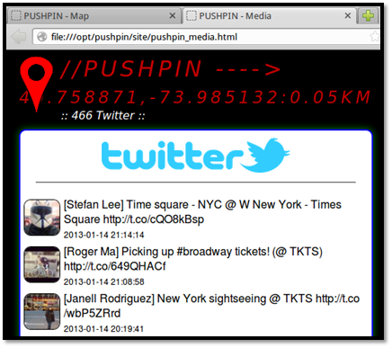
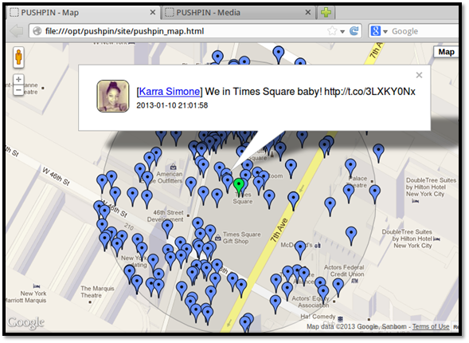

Pushpin
=======

Website
-------

<https://bitbucket.org/LaNMaSteR53/pushpin>

Description
-----------

Identify every tweet, flicker pic, and Youtube video within an area of a 
specific set of geocoordinates.

Install Location
----------------

`/opt/recon-ng/`

Usage
-----

A version of Pushpin can be found integrated within the Recon-ng framework.
Recon-ng now contains six Pushpin/Recon modules and one Pushpin/Reporting module.

An overview of the available modules can be found by launching Recon-ng and attempting
to load an arbitrary "pushpin" module.

To run Recon-ng first change into the install directory:

`~$` **`cd /opt/recon-ng`**

And run the main application with the `--no-check` flag to tell Recon-ng to not check for updates:

`/opt/recon-ng$` **`./recon-ng --no-check`**

`[recon-ng][default] >` **`use pushpin`**

        [*] Multiple modules match 'pushpin'.
        
        Recon
        -----
          recon/locations-pushpins/flickr
          recon/locations-pushpins/instagram
          recon/locations-pushpins/picasa
          recon/locations-pushpins/shodan
          recon/locations-pushpins/twitter
          recon/locations-pushpins/youtube
        
        Reporting
        ---------
          reporting/pushpin

Example 1: Find Tweets Sent from Times Square
---------------------------------------------

Open a new terminal, change into the recon-ng directory and launch recon-ng:

`/opt/recon-ng$` **`./recon-ng --no-check`**

Twitter requires an API key to process our requests.
To get an API key you will need to first create a new app.

Visit https://dev.twitter.com/apps and create a new app.

As soon as the app is created you should be able to access the key and secret key.

These can be entered into the recon-ng database from the recon-ng prompt as follows (the X's should be replaced with the keys):

`[recon-ng][default] >` **`keys add twitter_api XXXXXXXXXXX`**

        [*] Key 'twitter_api' added.

and

`[recon-ng][default] >` **`keys add twitter_secret XXXXXXXXXXXXXXXXXXXXXX`**

        [*] Key 'twitter_secret' added.

You should only have to enter these once.

Now lets add a location record into the database to target our desired location.

Run these commands to add a location record pointed at Times Square:

`[recon-ng][default] >` **`query insert into locations (latitude, longitude) values ("40.758871","-73.985132");`**

    [*] 1 rows affected.

Now that the fun part is out of the way, let's load up the twitter module.

`[recon-ng][default] >` **`use pins/twitter`**

Notice how we used the shorthand version of "recon/locations-pushpins/twitter" to load the module faster.

`[recon-ng][default][twitter] >` **`show options`**

         Name       Current Value  Req  Description
        ---------  -------------   ---  -----------
        RADIUS     1               yes  radius in kilometers
        SOURCE     default         yes  source of input (see 'show info' for details)

Looks like everything is good to go, the radius is set, the SOURCE should be automatically reading from the database where our location is stored.
Now let's run the module.

`[recon-ng][default][twitter] >` **`run`**

        --------------------
        40.758871,-73.985132
        --------------------
        [*] Collecting data for an unknown number of tweets...
        [*] 1349 tweets processed.
        
        -------
        SUMMARY
        -------
        [*] 862 total (862 new) pushpins found.

Once the module completes execution the data has been saved to the database.
To view it, we will need to use the reporting module.

`[recon-ng][default][twitter] >` **`use reporting/pushpin`**

It's always a good idea to show the options before executing a module

`[recon-ng][default][pushpin] >` **`show options`**

        Name            Current Value                  Req  Description
        --------------  -------------                  ---  -----------
        LATITUDE                                       yes  latitude of the epicenter
        LONGITUDE                                      yes  longitude of the epicenter
        MAP_FILENAME    /home/adhd/pushpin_map.html    yes  path and filename for pushpin map report
        MEDIA_FILENAME  /home/adhd/pushpin_media.html  yes  path and filename for pushpin media report
        RADIUS                                         yes  radius from the epicenter in kilometers

We will have to set the LATITUDE and LONGITUDE and RADIUS values real quick.

`[recon-ng][default][pushpin] >` **`set LATITUDE 40.758871`**

        LATITUDE => 40.758871

`[recon-ng][default][pushpin] >` **`set LONGITUDE -73.985132`**

        LONGITUDE => -73.985132

`[recon-ng][default][pushpin] >` **`set RADIUS 1`**
    
        RADIUS => 1

`[recon-ng][default][pushpin] >` **`show options`**

        Name            Current Value                  Req  Description
        --------------  -------------                  ---  -----------
        LATITUDE        40.758871                      yes  latitude of the epicenter
        LONGITUDE       -73.985132                     yes  longitude of the epicenter
        MAP_FILENAME    /home/adhd/pushpin_map.html    yes  path and filename for pushpin map report
        MEDIA_FILENAME  /home/adhd/pushpin_media.html  yes  path and filename for pushpin media report
        RADIUS          1                              yes  radius from the epicenter in kilometers

That's better, now let's run this module

`[recon-ng][default][pushpin] >` **`run`**

        [*] Media data written to '/home/adhd/pushpin_media.html'
        [*] Mapping data written to '/home/adhd/pushpin_map.html'

Once the module executes, it should automatically open Firefox to your report.

**Page displaying all the tweets found within the specified border.**

**Map showing where each tweet came from. Clicking on a bubble shows the tweet.**

It's very important to note that gathering and reporting are two separate operations.
They can be set focus on differing geographical locations.  

Gathering loads information into the database.

Reporting takes information from the database and prepares it for human consumption.

