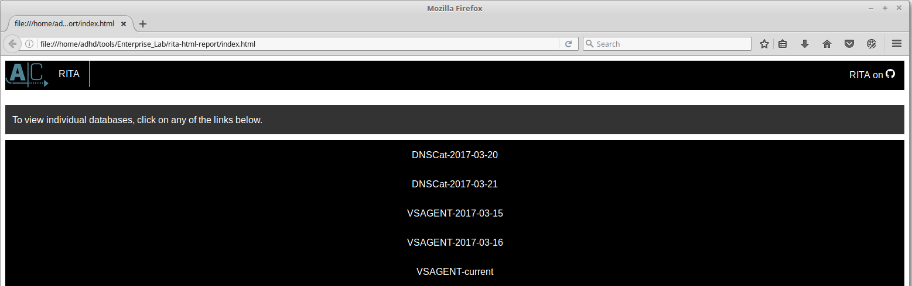
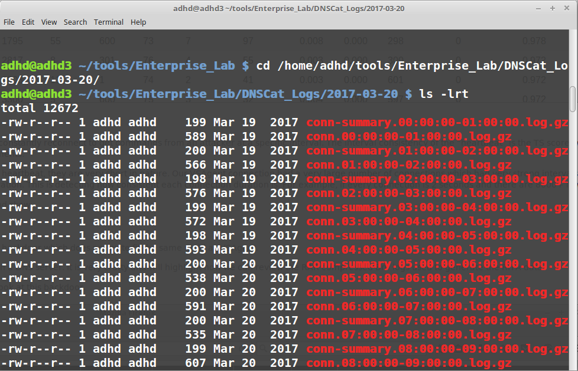

# Enterprise-wide Identification and Analysis

## Brief Intro:
In this lab we'll be using [RITA](https://www.activecountermeasures.com/free-tools/rita/) (short for Real Intelligent Threat Analytics) from Active Countermeasures.  RITA ingests [Bro](https://www.bro.org/) logs and does analysis on them.

## Try It Yourself:
If you're familiar with RITA, start it up and generate a report to find the anomalous traffic.

## Walk Through:

### Enterprise-Wide Identification and Analysis
For this lab, we will be looking at two different beaconing tools.  Both of which are very, very hard to detect with traditional signature-based utilities.

The first utility is called VSAgent.  It is a backdoor which beacons at a very steady 10-second interval.  All of its communication is base64 encoded and sent over cleartext HTML.

The next tool is called DNSCat2 by Ron Bowes.  It is a utility which uses DNS as its main C2 channel.

Both of these tools represent the need for manual analysis of odd traffic behavior.  But, they also show us how we can use the bottleneck of DNS URL and connection logs to see potential beaconing behavior.

### RITA
For this lab, we will be using Real intelligence Threat Analytics (RITA).  It is a utility written by Black Hills Information Security and ActiveCountermeasures.com to assist in hunt teams to identify advanced attackers who easily bypass most traditional security products.

It does a number of different forms of analysis on Bro logs.   It uses Bro specifically because Bro is consistent in its logging of connection timestamps and network traffic metadata.

For this lab, we will be focusing on beaconing analysis, URL analysis, and DNS analysis.

### RITA Setup
First, we will need to navigate to the proper directory:
`$ cd /home/adhd/tools/Enterprise_Lab/`
 

Now, let’s take a look at the directories.
`$ ls -lrt`

We have two separate Bro captures we are reviewing.  One for DNSCat2 and the other is for VSAgent.   For this lab, the Bro sensor was positioned to capture traffic as it was leaving the test environments.

We have already imported the Bro data into RITA with the following commands:
**PLEASE DO NOT RUN THESE COMMANDS**
We are simply including these if you ever want to run RITA yourself.
`# rita import -I <Path to Bro Logs> -d <Database to dump the logs>`
`# rita analyze`

Again, you do not need to run this now as it can take some time.

### Generating the Reports
Now we will need to review the data using RITAs HTML output ability.  There are a number of output options like show-beacons, show-blacklisted, and show-long-URLs.  All of this can easily be outputted to .csv.  However, for this lab, we will be using the HTML output as it is easier to read for this lab.
`$ sudo service mongod start`
`$ rita html-report`

The above command will generate the report in the rita-html-report directory.
It will also automatically open the created pages in Firefox.
As you can see, it has two separate options for review. VSAgent-2017-3-15 and DNSCat-2017-03-21.  There are other dates.   Please ignore those for now.

Let’s select VSAGENT-2017-3-15.

### Review Options
The tabs across the top allow you to review the output for all the different analysis modules of RITA.
For VSAgent we will be focusing on Beacons, Blacklisted and User Agents.

Please select Beacons now.

### Beacons
Some backdoors have a very strong “heartbeat”.  This is where a backdoor will constantly reconnect to get commands from an attacker at a specific interval.   The interval consistency of the “heartbeat” is the TS score where a value of 1 is perfect.  The top value in this set is the VSAgent communication.  We will talk about the other connections in a few moments.

We also have the number of connections.  While some beacons have a “strong” heartbeat, they are very short in nature.  Our VSAgent connection had a very large number of connections which had very strong intervals, while some of the others (e.g. the 64.4.54.253 addresses) had a strong heartbeat, but not as many connections.  We will also talk about TS Duration.  This is detecting how consistent each connection duration is.  For example, if every connection is 2 seconds and there are 8000+ it would have a very strong TS Duration score.

The other fields are statistical analysis fields showing things like mode range and skew.

### DNSCat2
Now, select RITA and then select DNSCat-2017-03-21.  We are going to review a backdoor which does not quite fit the same mold as VSAgent.

This does not beacon back to a specific IP address, but rather it beacons through a DNS server.  It is very crafty and will highlight how we can review the RAR compressed Bro logs used to generate the RITA data.

For this one, we are going to jump right to the DNS tab.  It gives us the clearest look at this backdoor.
 

A couple of things should jump out at an investigator straight away. First, there were over 40K requests for cat.nanobotninjas.com.  This is an absurd number for a specific domain.  Sure, there are lots of requests for com and org and net and uk, but that is to be expected.

### Searching Bro Logs
First, we need to change directories to where the raw data RITA analyzed is:
`$ cd /home/adhd/tools/Enterprise_Lab/DNSCat_Logs/2017-03-20`
`$ ls -lrt`

This is one of the two directories RITA reviewed.  Since the capture ran overnight we are just checking one day.  By default, Bro will capture a large variety of data including connection logs, DNS data, and HTTP data.

But, the data is compressed!! And in a whole bunch of files!!!
To get around this, all we need to do is use zgrep!

### zgrep
Because we have an odd domain with a very large number of Subdomains we want to pull all entries out of the compressed Bro DNS logs.

We do that with the following command:
`$ zgrep nanobotninjas dns*`

This will search for the nanobotninja string in any file with dns in the name.

### Searching Bro Logs
In the below screen, we can see the output of the query.  Turns out, there were a very large number of TXT requests from 10.234.234.105 for cat.nanobotninja.com (1).

But, look at the subdomain!  Right before cat. We can see a random string(2).  This is never normal activity and it happens because DNSCat needs to generate a new request for each subdomain “system” to avoid cached results.  This forces the DNS server (8.8.8.8) to constantly go to the nanobotninja.com DNS server for resolution(3).   And, that is how some DNS C2 channels can be detected!

### Conclusions
In this lab, we looked at a couple of backdoors which traditionally are difficult to detect with current IDS/IPS technology. However, using statistical and frequency analysis using Bro and RITA we can look for anomalies.  Those anomalies can lead to interesting domains and connection patterns which can be indicative of an advanced adversary.  RITA also supports a number of features to make analysis even more powerful such as Domain Whitelisting, IP Whitelisting and Domain Name Generation algorithms

RITA is free and can be installed in less than 5 min on an Ubuntu system. So, go get it!

## Why This Lab is Important:
It's vital to be able to review network data for indicators of data exfiltration or command and control (sometimes called C2) traffic. If you have the right tooling, like RITA and Bro, detecting this can be very easy. Unfortunately, many environments have little or no monitoring setup to detect tools such as these. All defenders should periodically check to see if they have the ability to at least detect when attacks are used on their network.

## Bonus (If Time Permits or Homework)
* Look at the extensive [documentation](https://www.bro.org/documentation/index.html) and [training](https://www.bro.org/documentation/tutorials/index.html) the Bro project provides for **_free_**.
* Setup Bro and RITA in a lab and use the tools and techniques you learn in this class. You should be able to see many of these attacks!

## Additional Resources:
### SANS classes related to this lab
[SANS SEC 503: Intrusion Detection in Depth](https://www.sans.org/course/intrusion-detection-in-depth)
[SANS SEC 511: Continuous Monitoring and Security Operations](https://www.sans.org/course/continuous-monitoring-security-operations)
[SANS SEC 555: SIEM with Tactical Analytics](https://www.sans.org/course/siem-with-tactical-analytics)

### Other resources related to this lab
Network Forensics: Tracking Hackers Through Cyberspace
