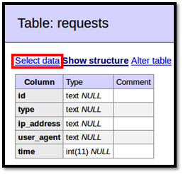

Web Bug Server
==============

Website
-------

<https://bitbucket.org/ethanr/webbugserver>

Description
-----------

Easily embed a web bug inside word processing documents. These bugs are
hidden to the casual observer by using things like linked style sheets and 1 pixel images.

Install Location
----------------

`/var/www/web-bug-server/`

`/opt/webbugserver/`

Usage
-----

Visit [http://127.0.0.1/web-bug-server/index.php](http://127.0.0.1/web-bug-server/index.php) to view the usage.

This page is intended for receiving Word web bugs as detailed here [http://ha.ckers.org/webbug.html](http://ha.ckers.org/webbug.html)

Requests should be in the form `http://<server IP addres>/web-bug-server/index.php?id=<arbitrary document id>&type=<css|img>`

Video Walkthrough
-----------------

<video controls>
  <source src="Videos/1_550_WebBug.mp4">
  <source src="https://onedrive.live.com/download.aspx?cid=8D6C4317A39E3D29&resid=8D6C4317A39E3D29%2155683&canary=">
 
Your browser does not support html5 video.

</video>

Example 1: Setting up the Web Bug Doc
-------------------------------------

First, you need to find the current IP address of your ADHD machine. Do
so by firing up a new terminal and using the ifconfig command.

`$` **`ifconfig`**

        eth0    Link encap:Ethernet  HWaddr 00:0c:29:6c:14:79
                inet addr:192.168.1.137  Bcast:192.168.1.255  Mask:255.255.255.0
                inet6 addr: fe80::20c:29ff:fe6c:1479/64 Scope:Link
                UP BROADCAST RUNNING MULTICAST  MTU:1500  Metric:1
                RX packets:117282 errors:0 dropped:0 overruns:0 frame:0
                TX packets:43840 errors:0 dropped:0 overruns:0 carrier:0
                collisions:0 txqueuelen:1000
                RX bytes:105331151 (105.3 MB)  TX bytes:4364108 (4.3 MB)
                Interrupt:19 Base address:0x2000

The IP address in this example is 192.168.1.137 so this is what will be
used from now on. Replace this with your own IP address wherever you see it appear.

Now you'll need to configure the web bug document to connect back to the
web bug server running on your ADHD machine. Change into
/opt/webbugserver/ and use the following command to edit the provided
.doc file. Replace 192.168.1.137 in the command with the IP address you found above.

`/opt/webbugserver$` **`sudo sed -r 's://.*/web-bug-server://192.168.1.137/web-bug-server:g' web_bug.html > web_bug.doc`**

Next, you will need to move web\_bug.doc to another machine. You can use
Linux (LibreOffice), Windows (Microsoft Word), or Mac OS (Microsoft Word
or TextEdit) to open the file. If you do not have another computer with
one of those applications installed, you can open it locally on the ADHD
machine. To get web\_bug.doc to another machine first copy it to the web directory.

`/opt/webbugserver$` **`sudo cp web_bug.doc /var/www/`**

Then on the computer you want to copy the file to, open a web browser
and go to `http://192.168.1.137/web_bug.doc` to
download the document. Remember to replace the IP address with the one
you found for your local ADHD machine. Once the document is saved to the
remote computer, open it in one of the editors mentioned above to
trigger the bugs. See [Example 2: Viewing Bug Connections in the Database] on viewing the results.

Example 2: Viewing Bug Connections in the Database
--------------------------------------------------

Any time a web bug is triggered, it makes a connection back to the
server running on the ADHD server, which then records information about
the connection in a database. To view the information stored in the
database, open a web browser and visit [http://127.0.0.1/adminer/](http://127.0.0.1/adminer/) 
and log in using `127.0.0.1`, `webbuguser`, `adhd`, and `webbug` for the Server,
Username, Password, and Database respectively.

Once logged in, click on the `requests` table, and then click `Select
data`.

 

From here, you can view all the entries in the database created by web
bugs. Each entry includes the document id which you can change by
editing the .doc file, the type of media request that was triggered, the
IP address the connection came from, and the time the connection was
made. The time is stored as a UNIX timestamp represented by the number
of seconds elapsed since 1 January 1970. There are numerous converters
available online that you can use to translate these into your local
time.

