Kansa
=====

Website
-------

<https://github.com/davehull/Kansa>

Description
-----------

A modular incident response framework in Powershell. It uses 
Powershell Remoting to run user contributed, ahem, user contributed 
modules across hosts in an enterprise to collect data for use
during incident response, breach hunts, or for building an environmental
baseline.

Video Walkthrough
-----------------

<video controls>
  <source src="Videos/1_550_Kansa.mp4">
  <source src="https://onedrive.live.com/download.aspx?cid=8D6C4317A39E3D29&resid=8D6C4317A39E3D29%2155667&canary=">
 
Your browser does not support html5 video.

</video>

Example 1: Usage
----------------

First, let’s get started by looking at the files in the Kansa\_Output
folder in the Windows\_Labs folder on your class USB.

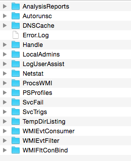

Let's move the whole Kansa_Output folder to the C:\Tools Directory on your Windows system. 

Like so:

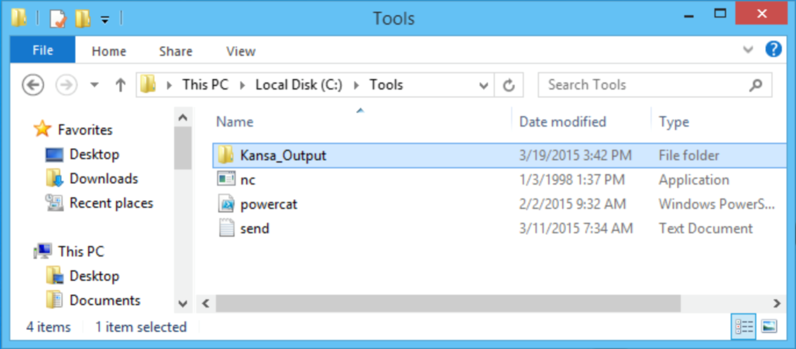

Simply digging through the files can be maddening. You have to know
where to start looking first in order to understand what is going on
with the data.

First, understand that Kansa takes a fairly robust IR inventory of each
system. Trying to analyze each system output on its own is fairly
maddening. However, it also does a great job of doing quick analysis and
providing stacked analyses.

First, in incident response, we try our best to start by looking at
network connections and DNS entries.

Let’s start by looking at the DNS entries for all the systems. The main
folder we will be using is AnalysisReports. This has the quick Kansa
analysis and Stacked analysis as well.

Please open the DNSCacheStack.tsv file. Notepad or Wordpad should work
just fine for this.

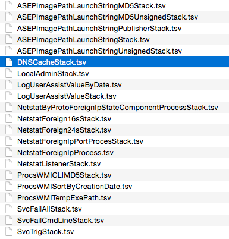

When opened, you should see data like what is displayed below:

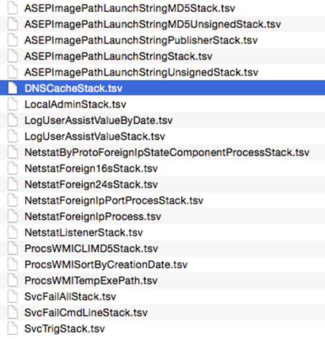

These are the DNS entries for the systems, which Kansa pulled data from.
The most important aspect is the "ct" value. This is the count. This is
a record of the number of systems or times this entry was seen. Now, for
this lab, it is pretty obvious which entries are "evil" because they
have evil in the title. However, in the real world this can be far more
difficult. We recommend an excellent tool by Ethan Robish that reviews
IP addresses and DNS names for known blacklist entries.

It can be found here:

[https://bitbucket.org/ethanr/dns-blacklists](https://bitbucket.org/ethanr/dns-blacklists)

Next, let’s take a look at the network connections.

For this, we will look at the NetstatForegin24sStack.tsv file. The 24
denotes a Classless Inter-Domain Routing (CIDR) denotation, which means
it is showing the whole IP address. There is also a 16 file that is
helpful for identifying network blocks of possible evil traffic.

As you can see below, we have one process, which looks odd.

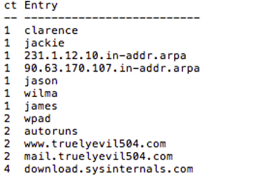

Once again, for the purpose of this lab we wanted to make the malware
fairly obvious. So, we named it FuzzyKatz.exe. Also, it is connecting to
a RFC 1918 internal address. We did this so people do not make
connections to potentially evil sites. BTW, it is generally a bad idea
to simply surf to IP addresses in labs. You may get infected. Later in
the class, we will show you how to "safely" connect to potentially evil
IP addresses.

For this we will start by searching through LogUSerAssistValueByDate.tsv
and search for FuzzyKatz.exe

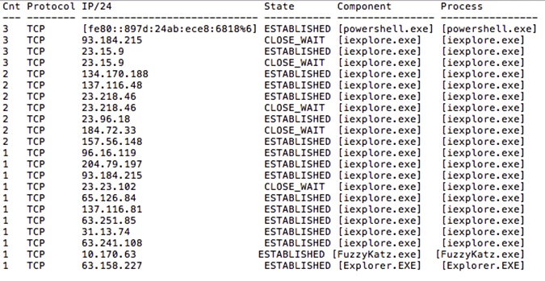

Sure enough we found it and we see there are two other potential pieces
of malware. One is msf.exe, and the other is VSAgent.exe. Why did we not
see these two on the network connections? For msf.exe it was using IE as
its C2 and for VSAgent, it beacons at irregular intervals.

Now, where else are these values referenced?

There are two ways to find out. You could look through every file by
hand… That would take a while.

Or, you could use PowerShell and sls.

Lets use PowerShell..

Launch an Administrative PowerShell prompt. To do this press your start
button and type PowerShell. Right click on the PowerShell icon and
select "Run as Administrator".

Depending on your how your Window OS is configured, you may have to
click "Accept" to run the program as Administrator. This is typical
behavior for UAC.

Note: You can make sure it is an Administrator prompt by checking to see
"Administrator" in the title bar. If you don't see "Administrator"
somewhere in the title bar on the PowerShell window on your computer,
please close this window and be sure to right click "run as
Administrator"

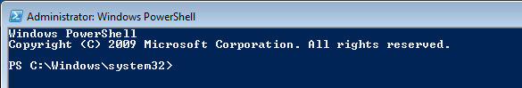

Note the "Administrator" in the upper left corner.

Now lets move to the Kansa\_Output directory:

Now, we can run some sls commands to search recursively through the
Kansa Output directories. We will take the output of ls \* -r (the \* is
everything and the –r is recursive) andy pipe it through the sls command
to find interesting strings.

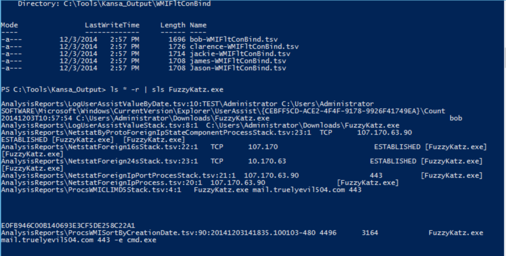

As you can see above FuzzyKatz is on bob, and is making a TCP connection
to 107.170.63.90 (don't go there!).

We can also look for the msf.exe process:

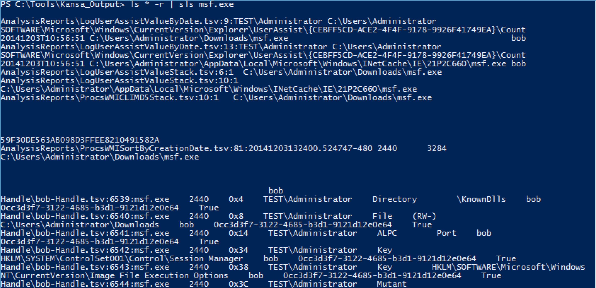

And, we know that 107.170.63.90 is being used as a command and control
server, we can see if any other systems are making a connection!

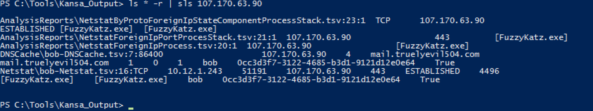

While the output is nice, it can be a bit more data than what we are
looking for. Maybe, we just want to see the path the hit with sls was
found in. This way we can see exactly which system the associated hit
was located in

To do this, we can pipe the output though "select –unique path"

Like so:

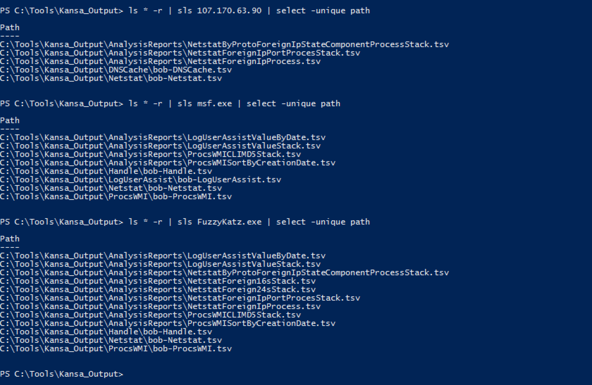

Now, we can get the specific system name (bob) the malware was located
in!
