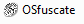
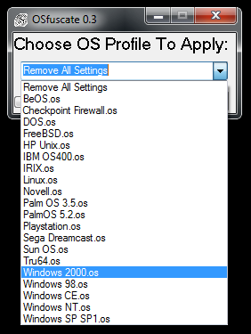
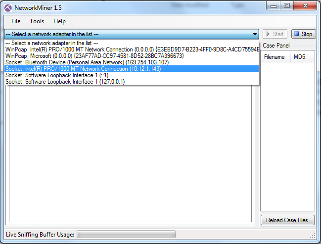
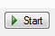
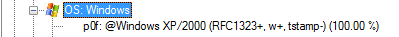

OsFuscate
=========

Website
-------

<http://www.irongeek.com/i.php?page=security/osfuscate-change-your-windows-os-tcp-ip-fingerprint-to-confuse-p0f-networkminer-ettercap-nmap-and-other-os-detection-tools>

Description
-----------

From IronGeek.com:

> I was wondering awhile back how one could go about changing the OS
fingerprint of a Windows box to confuse tools like Nmap, P0f, Ettercap
and NetworkMiner. I knew there were registry setting you could change in
Windows XP/Vista that would let you reconfigure how the TCP/IP stack
works, thus changing how the above tools would detect the OS.  I wasn't
sure what all registry changes to make, but luckily I found Craig
Heffner's tool Security Cloak ([sec\_cloak.exe](http://www.irongeek.com/downloads/sec_cloak.zip))
and by looking at it's source I was able to figure out what to do.  The
needed IP stack changes were hardcoded into Security Cloak, but for my
tool I decided to make it easier to update by allowing the user to add
new OS fingerprint profiles as ini files. Yes, I know this is security
through obscurity and the attacker can still probably figure out the OS
on a box by other means, but I still think it's kind of cool to play
with.

Video Walkthrough
-----------------

<video controls>
  <source src="Videos/1_550_OSfuscate.mp4">
  <source src="https://onedrive.live.com/download.aspx?cid=8D6C4317A39E3D29&resid=8D6C4317A39E3D29%2155690&canary=">
 
Your browser does not support html5 video.

</video>

Example 1: Setup
----------------

**To Install:**

1\. Copy OSFuscate from the Windows directory of the class USB or from
the Windows directory on the ADHD VM to your desktop

***Basic Configuration:***

2\. Open the folder and click on the OSFuscate Icon:

3\. Select Windows 2000

4\. Select Apply.

5\. Reboot your system

Example 2: Usage
----------------

Install Network Miner from the Windows Directory of the class USB or
from http://www.netresec.com/?page=NetworkMiner . We prefer to extract
it to the Desktop

Open Network Miner and click on the Network Miner icon in the
NetworkMiner folder:

Select your Network interface

Click Start

When you see your IP Address listed in in the capture pane, select it.

Review the OS details

Please note that Satori is far more accurate. However, it tends to work
only on the local network.
