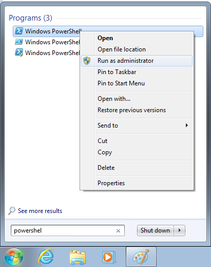
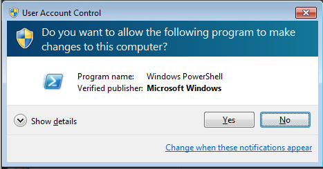
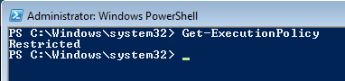
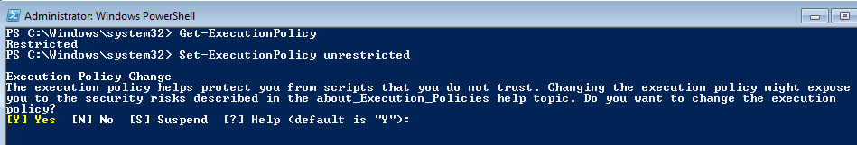
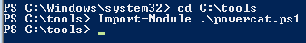
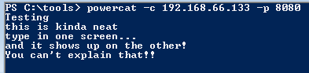
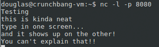
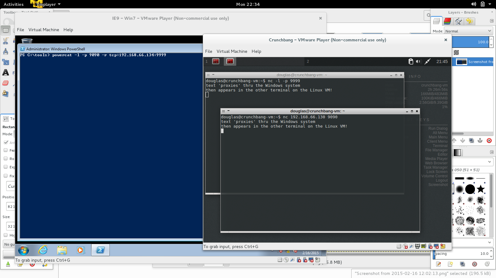

Powercat
========

Website
-------

<https://github.com/besimorhino/powercat>

Description
-----------

Powercat is a PowerShell implementation of netcat. This PowerShell
module offers all the functionality of netcat with a few added features.
In this lab, we'll do a series of exercises which covers the most common
use cases of powercat. If you finish these exercises early, there's some
bonus questions to do. Do not worry if you cannot get to them during
class. Feel free to answer them later when you are going through the
materials after the class has completed. Also, this lab has a challenges
section. You don't have to ever do these, but they can be exceptionally
rewarding and interesting to try!

Video Walkthrough
-----------------

<video controls>
  <source src="Videos/1_550_PowerCat.mp4">
  <source src="https://onedrive.live.com/download.aspx?cid=8D6C4317A39E3D29&resid=8D6C4317A39E3D29%2155688&canary=">
 
Your browser does not support html5 video.

</video>

Example 1: Setup
----------------

NOTE: You must have Windows 7 or more recent to complete this lab. If
you have Windows XP, you will **not** be able to do this lab. While
licensing prevents SANS from distributing copies of Windows to those
that don't have it (I.E. those with Mac or Linux systems) we can direct
you to a free for use copy of Windows. This is a limited use VM. It
cannot be used for profit, and is only good for 30 days. Please read the
licensing information at the site above for more information and
important details.
[https://www.modern.ie/en-us/virtualization-tools#downloads](https://www.modern.ie/en-us/virtualization-tools#downloads)

Launch an Administrative PowerShell prompt. To do this press your start
button and type PowerShell. Right click on the PowerShell icon and
select "Run as Administer".

Depending on your how your Window OS is configured, you may have to
click "Accept" to run the program as Administrator. This is typical
behavior for UAC.

Note: You can make sure it is an Administrator prompt by checking to see
"Administrator" in the title bar. If you don't see "Administrator"
somewhere in the title bar on the PowerShell window on your computer,
please close this window and be sure to right click "run as
Administrator"

Note the "Administrator" in the upper left corner.

Example 2: Verify Your Setup
----------------------------

From your Windows machine, ping the Linux VM.

`PS:` **`ping XXX`**

From the Linux VM, ping your Windows machine.

`$` **`ping XXX`**

(reminder: in the Linux VM, you'll need to press CTRL+c to stop the pinging)

Example 3: Change the Execution Policy and Import Powercat
----------------------------------------------------------

Check to see what your PowerShell script execution policy is.

In the PowerShell prompt, type

**`Get-ExecutionPolicy`** and hit **enter**

In a moment, we are going to be changing this value. So you know what to
return to, please write down what your execution policy is.

Now that you have written what your policy is, you can change your
execution policy.

Change your execution restriction policy to 'unrestricted' with this
command:

**`Set-ExecutionPolicy unrestricted`**

If you get a prompt warning asking you if you really want to do this,
please hit the 'Y' key and then hit **enter**

WARNING: this setting does have a security risk. In this case, any
PowerShell scripts will run. Which is likely not what you actually want
to happen. However, for the purposes of this lab, we're making this
change so it's easier to get things running.

Now we need to invoke the powecat module so it will run from our
administrative PowerShell prompt. To do this cd into the directory where
the powercat script is located.

`PS:` **`cd C:\tools\`**

`PS:` **`Import-Module powercat.ps1`**

Now that powercat is loaded in this PowerShell prompt, you will be able
to execute powercat commands directly from the command line interface.
If you want to go back and redo these labs at a later date, you will
almost certainly have to re-import the powercat

Note: It's important to note that in the interest of time, we're going
to skip the element of context with PowerShell. There should be a book
written on this complex topic. The reason it's critical to know at least
a little bit about context with PowerShell is it controls where and how
scripts and modules can be run. If you want to run powercat from another
PowerShell prompt, you MUST import the powercat module like you did
above or it will not be recognized by PowerShell as a command it can
run.

Now that you have powercat imported, it's time to get started doing
something useful.

Example 4: Common Powercat Tasks - Chat Mode
--------------------------------------------

In the Linux VM open a terminal and type the following:

`$` **`nc -l 8080`**

In the Windows system, in the PowerShell prompt, enter the following:

**`powercat -c YOUR_LINUX_IP -p 8080`**

While still in the PowerShell prompt, you can now type some text and hit
enter.

**`Testing`** **enter**

From our Windows system:

From our Linux system

If all went well, you should see your text appear in the Linux terminal.

Note: you *must* hit enter to send the text.

Have fun with this for a few moments. You can keep sending text back and
forth from one terminal to the PowerShell prompt. When you've had your
fill of typing text back and forth, hit *CTRL+C* to end the powercat
chat session.

Example 5: Common Powercat Tasks - File Transfers
-------------------------------------------------

One of the nicer features of netcat type tools, is the ability to move
files back and forth. Depending on the firewall(s) between the hosts,
may need to push files or pull files.

Setting up the listener:

on the Linux VM, type the following:

`$` **`echo "this is my data to move" > movefile.txt`**

`$` **`nc XXXIP 8888 < movefile.txt`**

What we've done is create a netcat listener that will stream the
contents of movefile.txt to any client that connects to it.

Setting up the client:

on you windows system, enter the following in your powershell prompt:

`PS:>` **`powercat -l -p 8888 -of C:\tools\received.txt`**

Shutting down the listener:

On the Linux VM, shut down the listener by entering CTRL+C in the
terminal you used to start the file push.

Example 6: Common Powercat Tasks - Pull a File from Windows
-----------------------------------------------------------

On your windows system enter the following at your powershell prompt

`PS:` **`echo "this is some other text to send" > win_move.txt`**

`PS:` **`powercat -l -p 7777 -in win_move.txt`**

(note: that's a lowercase L in the line above. Like PowerShell, powercat
is **not** case sensitive. So you can use whatever case you'd like.)

Example 7: Common Powercat Tasks - Powercat Relay
-------------------------------------------------

This is perhaps the most powerful mode of operation for powercat. This
allows you to create a pivot. Say you have three computers. A, B, and C.
A and C cannot talk to eachother due to firewall restrictions. A and B
can talk, B and C can talk. If we're on host A, we need to use B as our
jump into host C.

In your linux VM, create two different terminals. In one, start a netcat
listener.

`$` **`nc -l 9999`**

The second terminal will be used in a moment... please switch to your
Windows machine.

In your Windows system start the powercat relay:

`PS:` **`powercat -l -p 9090 -r tcp:LINUX-IP:9999`**

Go back to your Linux VM. In the second terminal, please type the
following

`$` **`nc WIN-IP 9090`**

Now what you type in this terminal will be relayed through your Windows
system and should be displayed in the first linux terminal you started!

Example 8: Optional/Advanced Tasks
----------------------------------

This section is for those who finished the labs before the other
students, or the students who didn't get enough powercat fun in the
limited time we have in class.

**Optional Question \#1**

There are 65,535 ports in TCP/UDP networking. However, what happens if
you specify a port that's over that? Try entering this yourself

On the Windows machine in one PowerShell prompt type the following

`PS:` **`powercat -l -p 75000`**

Powercat allows this!! PowerShell allows this. What is going on here?

Open up another PowerShell instance and run the import-module traick
again. Type the following to try to connect to the listener you just
started.

`PS:` **`powercat -c localhost -p 75000`**

That port does not exist, yet it doesn't throw an error!! But the client
connect attempt won't work?!? What is going on?!? Get to the bottom of
this mysterious port! There's several ways to solve this. We have given
you some hints you can use to solve this. Use a ROT13 decoder to
decipher the hints. (for instance rot13.com can help you greatly)

Hint 1:

`Hfr n gbby gung pna gryy lbh jung cbegf ner va hfr`

Hint 2:

`Jverfunex be argpng pna gryy lbh jung cbegf ner va hfr`

Hint 3:

`argpng -anbo`

**Optional Question \#2**
 
See what methods could be used to get around execution restriction
policies. Hint : there are at least 15 techniques available to bypass
execution restriction policies.

**Optional Question \#3**

We ran powercat in an administrative PowerShell prompt. Does powercat
require admin access to run?

Example 9: Cleanup
------------------

Change your execution restriction policy to what it was before you
started this lab. (Check what you wrote a few examples back)

`PS:` **`Set-ExecutionPolicy [What it was]`**

