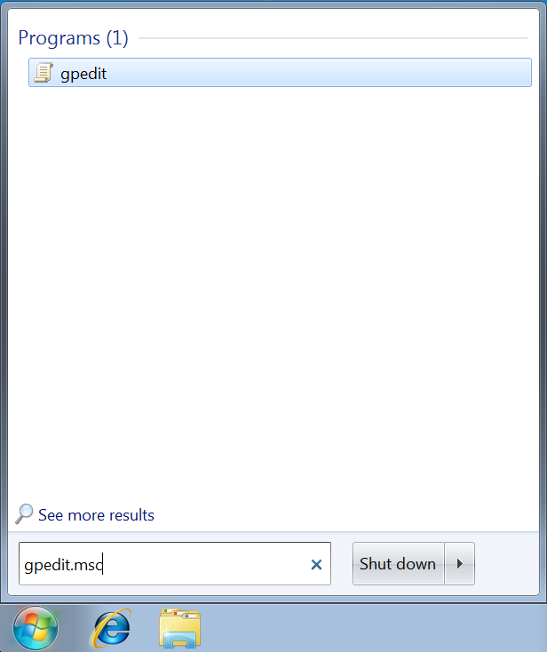
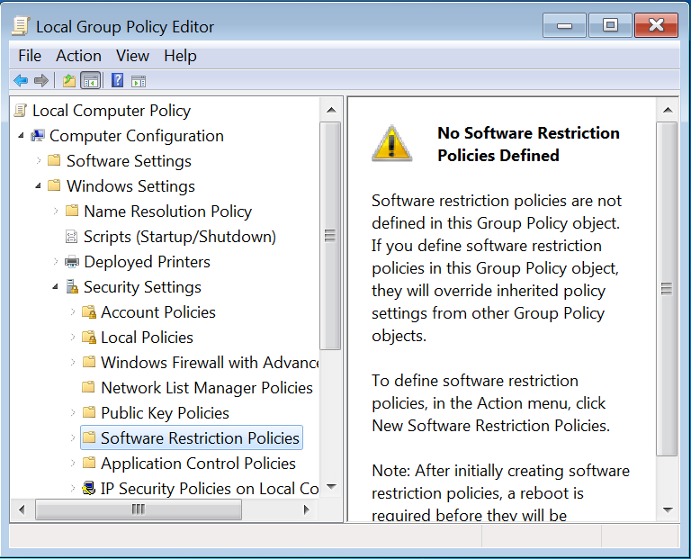
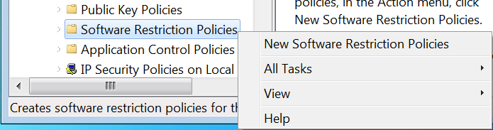
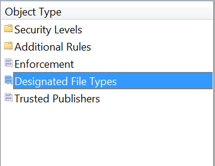
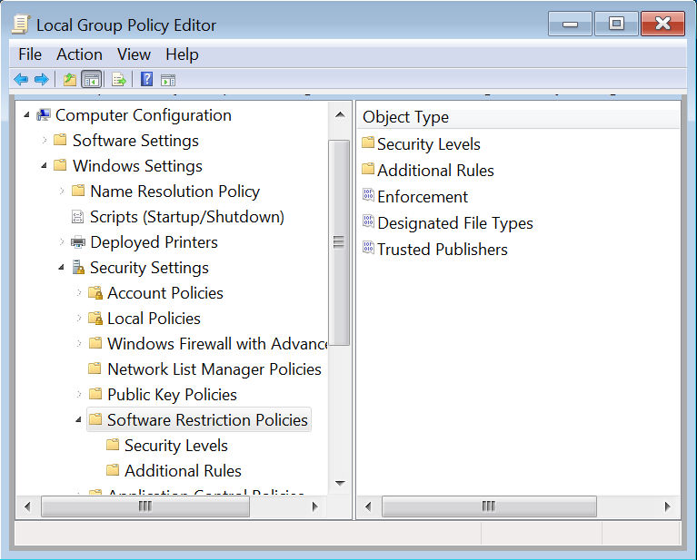
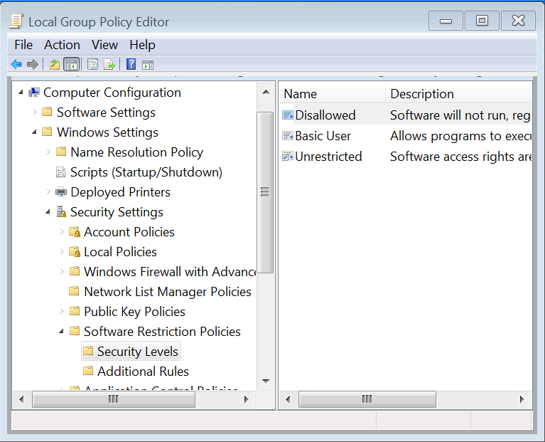
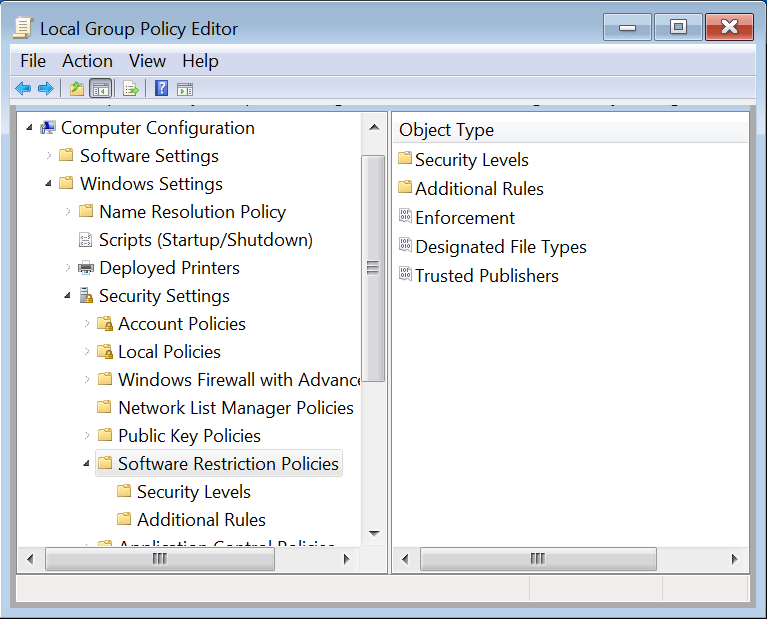
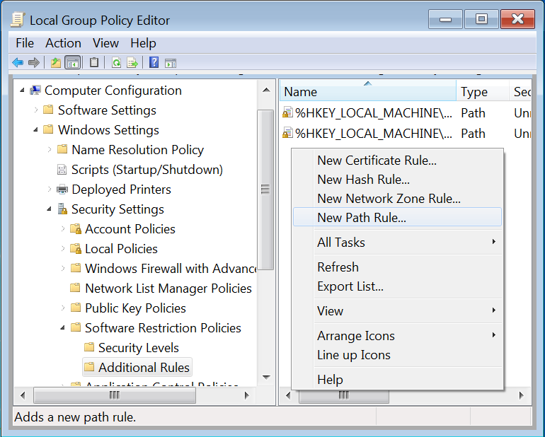
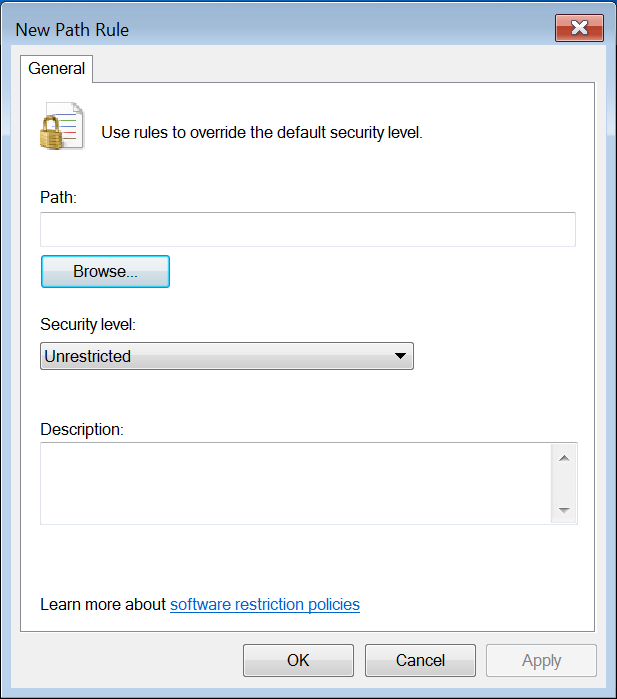

Software Restriction Policies
=============================

Website
-------

<https://github.com/davehull/Kansa>

Description
-----------

Pure, unmitigated awesomeness. They allow you to restrict which types of
files are allowed to run and where they are allowed to run from.

Basically, you restrict programs to execute from the Windows and Program
Files directories. Believe it or not, this stops most drive-by attacks.
In fact, we find it to be far more effective than traditional black-list
AV.

Video Walkthrough
-----------------

<video controls>
  <source src="Videos/1_550_SRP.mp4">
  <source src="https://onedrive.live.com/download.aspx?cid=8D6C4317A39E3D29&resid=8D6C4317A39E3D29%2155686&canary=">
 
Your browser does not support html5 video.

</video>

Example 1: Usage
----------------

Select the Start Menu in Windows 7. Then type **gpedit.msc**

Once in gpedit select: **Local Computer Policy > Security Settings > Software Restriction Policies**

Next Right Click on “Software Restriction Policies” and Select “New
Software Restriction Policies”.

Now, Select “Designated File Types”

Now, Select and remove LNK Shortcut

When the dialog box asks you if you are sure, select yes.

Click Apply, then OK.

Now, Select Security Levels.

Once the Security Levels Box is opened, select Disallowed

When the Disallowed box is open, select “Set as Default” then “Apply”,
Then “OK”.

Next, select “Software Restriction Policies” in the left pane.

Select Additional Rules

When Additional Rules is open right click in the right pane and select
“New Path Rule”.

When the “New Path Rule” Box is open, select “Browse”.

When the Browse box is open, select **Local Disk (C:) > Program Files(x86)**. Then click on OK.

Then click on Apply, then OK.

Now, reboot your machine.

If you want to disable the Software Restriction Policy simply come back
to gpedit.msc and set the Security Level to Unrestricted.

